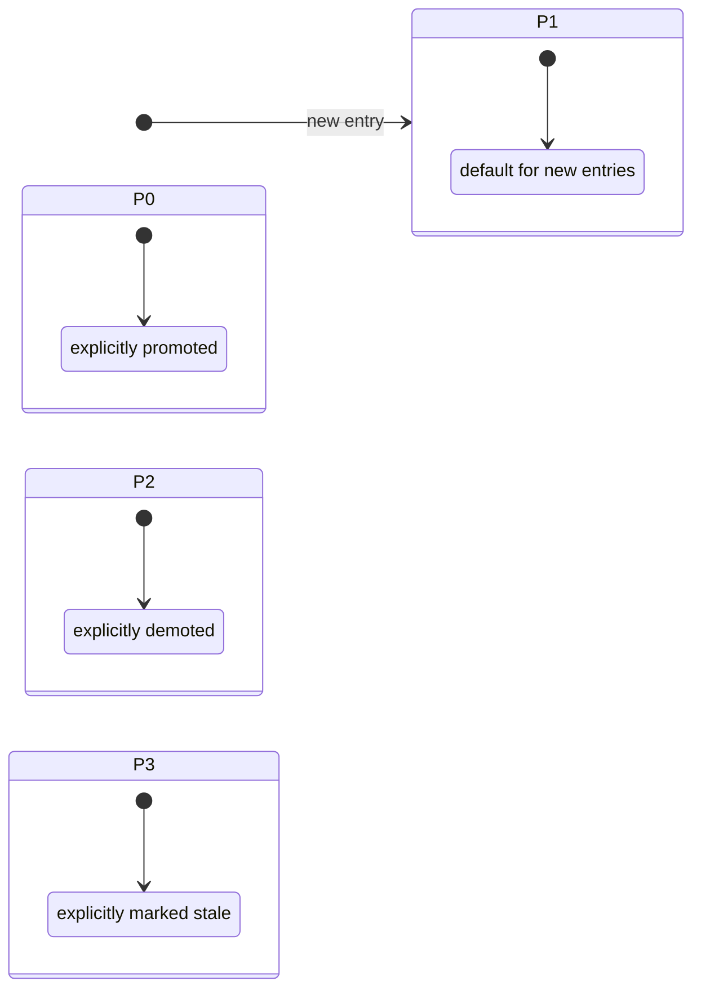
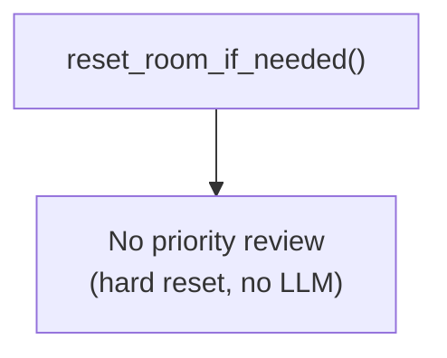

# Knowledge Priority Algorithm

## 1. Purpose

Defines the **priority system** for knowledge entries. With the removal of
LLM-based compression (replaced by hard reset — see
[Memory Reset](../memory/memory-reset.md)), the LLM-driven priority promotion
algorithm is **dormant**: no compression cycle identifies used entries, so
entries remain at their initial priority (P1) unless explicitly managed.

Priority still affects retrieval: P0 entries are always included in
`recall_knowledge` results, P1-P3 add progressively weaker score bonuses.
All entries appear in the index summary injected into context; priority
serves as a `[P0]`/`[P1]`/`[P2]`/`[P3]` tag to help the AI identify
high-priority entries to recall.

- Upstream: [Knowledge Management](knowledge.md) — defines `IndexEntry`
  and `KnowledgePriority` enum
- Downstream: WebDAV crate — reads/writes `index.json` with priority field

## 2. Diagram

### 2a. Priority State — Static (No Compression Trigger)

With hard reset replacing LLM compression, there is no automatic trigger
for priority promotion or decay. Entries stay at their current priority
unless explicitly changed by a future mechanism.



**Rules**:
- **P0** = always included in `recall_knowledge` results
- **P1** = default for new entries — strong recall bonus (+5)
- **P2** = moderate recall bonus (+2)
- **P3** = baseline (+0)
- **New entries default to P1**
- **No automatic promote/decay** — the former LLM-driven cycle no longer
  exists since hard reset does not identify used entries
- **All entries appear in the index summary** with a `[P0]`–`[P3]` tag;
  the AI uses this to decide which entries to recall

### 2b. Trigger — None (Dormant)



## 3. Data Structures

### IndexEntry Priority Fields

| Field             | Type               | Notes                                                       |
| ----------------- | ------------------ | ----------------------------------------------------------- |
| `priority`        | `KnowledgePriority` | Static priority; **default for new entries is P1** |
| `last_promoted_at`| `Option<String>` (ISO 8601) | Timestamp of last promotion; `None` means never promoted (dormant field) |

### KnowledgePriority

```rust
enum KnowledgePriority {
    P0, // explicitly promoted — always recalled
    P1, // default for new entries — strong recall (+5)
    P2, // moderate recall (+2)
    P3, // baseline (+0)
}
```

**Recall behavior** (`recall_knowledge` tool):
P0 entries are always included in `recall_knowledge` results regardless of
keyword overlap. P1-P3 add progressively weaker score bonuses. Context
injection (index summary) includes all entries regardless of priority.

| Priority | Score bonus | Always in recall_knowledge results? |
|----------|------------|-------------------|
| P0       | +8         | Yes               |
| P1       | +5         | No                |
| P2       | +2         | No                |
| P3       | +0         | No                |

## 4. Configuration

No dedicated config keys.

## 5. Integration with Other Subsystems

### With Knowledge Management

- Reads `index.json` for current entry metadata and priority
- New entries default to **P1**
- Priority affects `recall_knowledge` results: P0 always included, P1-3 get score bonuses
- All entries appear in the index summary with a `[P0]`–`[P3]` tag

### With Memory Management

- No longer triggered by memory reset cycles (formerly compression)
