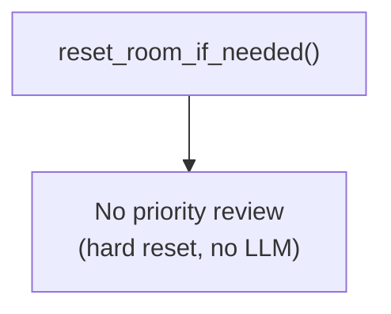

# Trigger — None (Dormant)

## 1. Purpose

With hard reset replacing LLM compression, no compression cycle identifies
used entries, so there is no trigger for priority review. This flow is
dormant.

References: `./structures.md`, `../memory/memory/retrieve-two-layers.md`

## 2. Diagram

