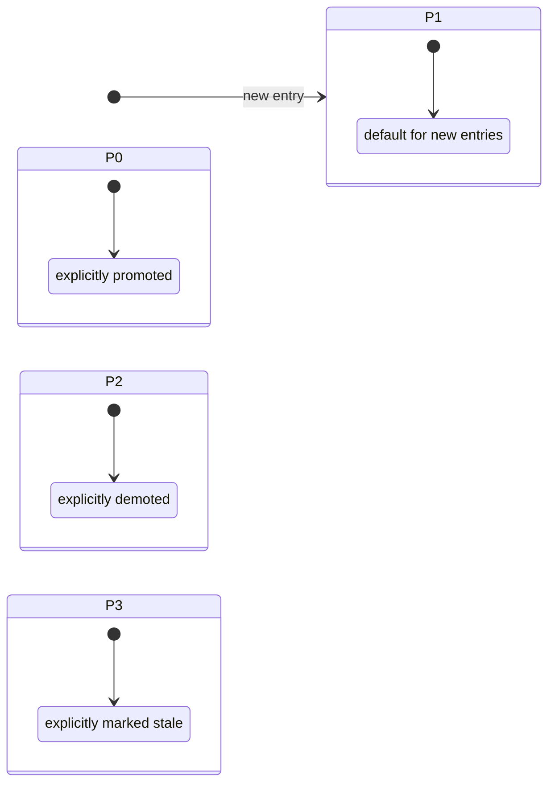

# Priority State — Static (No Compression Trigger)

## 1. Purpose

With hard reset replacing LLM compression, there is no automatic trigger
for priority promotion or decay. Entries stay at their current priority
unless explicitly changed by a future mechanism.

References: `./structures.md`, `../memory/memory/retrieve-two-layers.md`

## 2. Diagram

**Rules**:
- **P0** = always included in `recall_knowledge` results
- **P1** = default for new entries — strong recall bonus (+5)
- **P2** = moderate recall bonus (+2)
- **P3** = baseline (+0)
- **New entries default to P1**
- **No automatic promote/decay** — the former LLM-driven cycle no longer
  exists since hard reset does not identify used entries
- **All entries appear in the index summary** with a `[P0]`–`[P3]` tag;
  the AI uses this to decide which entries to recall
