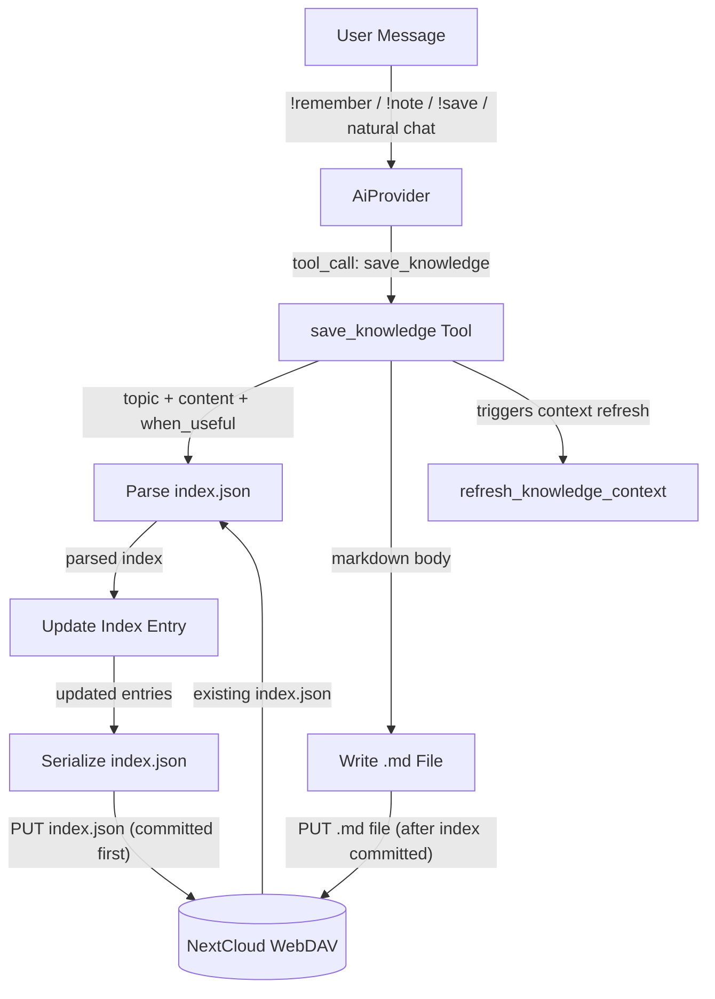
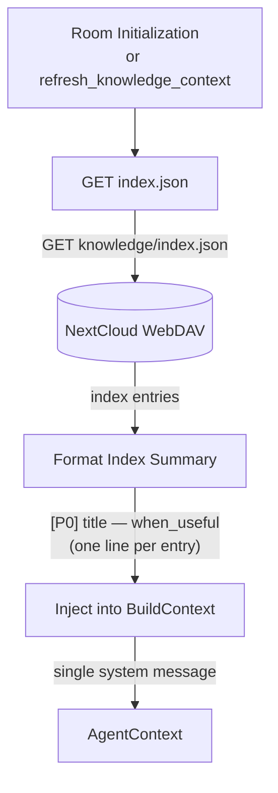
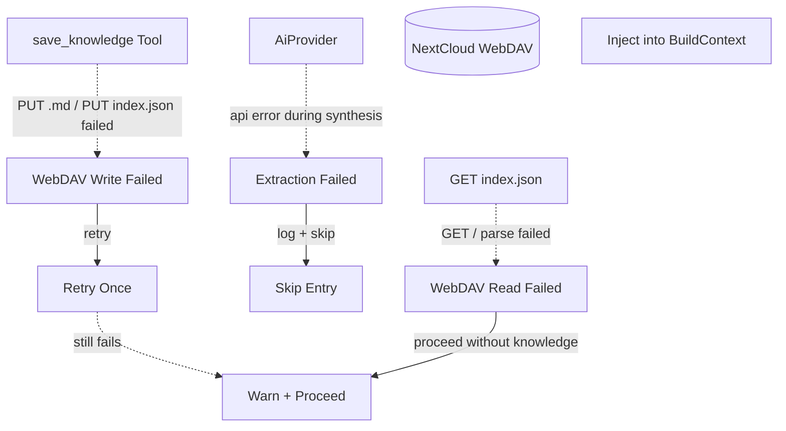
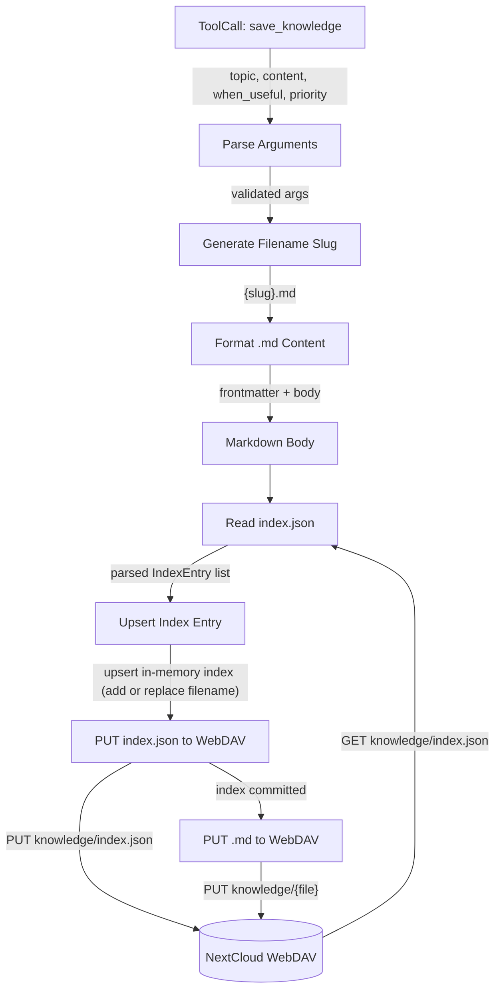

# Knowledge Management

Knowledge persistence is **always enabled** when WebDAV is configured — no
separate config toggle required. The `save_knowledge`, `forget_knowledge`, and
`recall_knowledge` tools are automatically registered alongside other
WebDAV-backed tools.

## 1. Purpose

Persistent per-room knowledge stored as `.md` files on WebDAV with a JSON
index for on-demand retrieval. Each entry lives in its own `.md` file
named `{slug}.md`. The `index.json` file lists every entry with a
`when_useful` field — a short description of the situation that makes this
knowledge relevant. The index is injected as a compact summary into agent
context; the AI uses `recall_knowledge` to fetch full `.md` bodies on demand.

### Write triggers

Knowledge is saved via the `save_knowledge` tool, which the AI provider can
call in two scenarios:

1. **Explicit command** — user says `!remember <thing>`, `!note <thing>`, or `!save <thing>`;
   the AI parses the instruction and emits `save_knowledge`
2. **Agent-initiated** — during normal conversation the AI determines
   something is worth persisting and emits `save_knowledge` autonomously

Magic words recognized by the system prompt:

| Magic word  | Maps to | Example |
|-------------|---------|---------|
| `!remember` | `save_knowledge` | `!remember that I prefer Python over JavaScript` |
| `!note`     | `save_knowledge` | `!note the prod server IP is 10.0.0.5` |
| `!save`     | `save_knowledge` | `!save that I prefer Python over JavaScript` |
| `!forget`   | `forget_knowledge` tool | `!forget the old database instructions` |

No frequency-based or periodic background extraction is planned.

### Retrieval

On room initialization (and on each `refresh_knowledge_context` call) the
harness loads `index.json` from WebDAV and injects a compact **index summary**
as a single system message. The summary lists every entry's priority,
`display_title`, and `when_useful` — enough metadata for the AI to decide
whether to recall a full entry. The AI uses the `recall_knowledge` tool to
fetch individual `.md` bodies on demand when it determines an entry is
relevant to the current conversation.

- Upstream: [Agent Harness](../agent/agent-harness.md) detects `save_knowledge` tool
  calls and loads knowledge on room init
- Upstream: [Configuration Management](config.md) provides WebDAV access
  (knowledge is always enabled when WebDAV is configured)
- Downstream: WebDAV crate persists `.md` files and `index.json`
- Downstream: [AI Provider](ai-provider.md) synthesizes knowledge entries from
  user instructions via `save_knowledge` tool calls
- Downstream: `BuildContext` receives injected knowledge as system messages
- Downstream: [Knowledge Priority Algorithm](knowledge-priority.md) — static
  priority system (dormant since compression removed; entries stay at P1)

## 2. Diagram

### 2a. Happy Flow — Write



### 2b. Happy Flow — Load

On each call to `refresh_knowledge_context`, the harness loads the room's
`index.json` from WebDAV, formats a compact summary (one line per entry:
priority, title, `when_useful`), and injects it as a single system message.
No `.md` body files are downloaded during context injection — the AI fetches
full entries on demand via the `recall_knowledge` tool.



### 2c. Error Handling



### 2d. Write Deep Dive — save_knowledge Tool

The `save_knowledge` tool writes the index first, then the `.md` file after the index is committed. This ensures the index is always authoritative — a missing `.md` file (partial write) won't corrupt the catalog. Existence checks are performed against the in-memory index, not the WebDAV filesystem.



### 2e. Retrieval Deep Dive — Index Summary and On-Demand Recall

Knowledge retrieval has two distinct paths:

1. **Context injection** (automatic, every turn): loads `index.json`,
   formats a compact summary, and injects it as a system message. No `.md`
   bodies are downloaded. The AI sees all entry titles, priorities, and
   `when_useful` descriptions.

2. **On-demand recall** (tool call): when the AI calls `recall_knowledge`
   with a query, the harness loads `index.json`, scores entries via keyword
   overlap against the query, downloads matching `.md` files, and returns
   their full content as a tool result.

```mermaid
flowchart TD
    subgraph CTX_INJECT["Context Injection (every turn)"]
        INIT1[refresh_knowledge_context]
        GET_IDX1["GET index.json"]
        DAV1[(NextCloud WebDAV)]
        FMT[Format Index Summary]
        SYS[Inject as System Message]

        INIT1 --> GET_IDX1
        GET_IDX1 -->|"GET knowledge/index.json"| DAV1
        DAV1 -->|"index entries"| FMT
        FMT -->|"[P0] title — when_useful"| SYS
    end

    subgraph ON_DEMAND["On-Demand Recall (tool call)"]
        TOOL["recall_knowledge(query)"]
        GET_IDX2["GET index.json"]
        DAV2[(NextCloud WebDAV)]
        SCORE["Score entries<br/>by keyword overlap"]
        LOAD["GET matching .md files"]
        RESULT["Return full .md content<br/>as tool result"]

        TOOL --> GET_IDX2
        GET_IDX2 -->|"GET knowledge/index.json"| DAV2
        DAV2 -->|"index entries"| SCORE
        SCORE -->|"matching filenames"| LOAD
        LOAD -->|"GET each .md"| DAV2
        DAV2 -->|"markdown content"| RESULT
    end
```



## 3. Data Structures

### `KnowledgeIndex`

Machine-readable JSON file at `{root}/{webdav_dir}/knowledge/index.json`.

| Field     | Type              | Notes                         |
| --------- | ----------------- | ----------------------------- |
| `version` | `String`          | `"rockbot-knowledge/1"`. Validates `min_length = 1` via `serde_valid`. |
| `room_id` | `String`          | WebDAV directory key. Validates `min_length = 1` via `serde_valid`. |
| `entries` | `Vec<IndexEntry>` | One descriptor per `.md` file. Validates via `serde_valid` (recursive validation of each `IndexEntry`). |

### `IndexEntry`

| Field         | Type               | Notes                                          |
| ------------- | ------------------ | ---------------------------------------------- |
| `filename`    | `String`           | `{slug}.md` — unique key and display identifier. Validates `min_length = 1` via `serde_valid`. |
| `when_useful` | `String`           | Situation description (retrieval trigger). Defaults to `""` (serde default). |
| `priority`    | `KnowledgePriority`| Current priority level. Static (dormant — see knowledge-priority.md); default for new entries is `P1`. |
| `last_promoted_at` | `Option<String>` | ISO 8601 timestamp of last promotion; `None` if never promoted. Dormant field. |

The `filename` doubles as the display key — `display_title()` strips the `.md`
suffix. The index summary injected into context is formatted as one line per
entry: `[{priority}] {display_title} — {when_useful}`. The AI uses this summary
to decide which entries to recall via the `recall_knowledge` tool, which
downloads the full `.md` body on demand. `when_useful`, `priority`, and
`last_promoted_at` are denormalized into the index for fast retrieval
and priority updates without reading every `.md` file.

### `KnowledgePriority`

```rust
enum KnowledgePriority {
    P0, // highest priority — always included in recall_knowledge results
    P1, // default — strong recall bonus (+5)
    P2, // moderate recall bonus (+2)
    P3, // baseline (+0)
}
```

**Priority**: the `priority` field lives exclusively in `index.json`'s `IndexEntry` —
not in `.md` file frontmatter. This keeps `.md` files as pure user-editable
knowledge content. Priority is defined by the
[Knowledge Priority Algorithm](knowledge-priority.md) — currently dormant
(no compression cycle to trigger promotion). Priority appears as a `[P0]`/`[P1]`
/`[P2]`/`[P3]` tag in the index summary, helping the AI identify high-priority
entries to recall. In `recall_knowledge` results, P0 entries are always included
regardless of keyword overlap; P1-P3 get score bonuses added to keyword overlap.

### Markdown Entry Format

Each `.md` file uses a simple structure with optional frontmatter.
Priority and promotion timestamps are **index-only** — they do not appear in
`.md` files, keeping them purely user-editable knowledge content.

```markdown
# {title}

**When Useful:** {when_useful}
**Tags:** {tag1}, {tag2}
**Created:** {created_at}
**Updated:** {updated_at}

{content — free-form markdown body}
```

### File Layout

```
{root}/{webdav_dir}/knowledge/
├── index.json
├── db_api.md
├── openai_key.md
├── driver_contact.md
└── ...
```

Examples:

```
rockbot/r-general/knowledge/index.json
rockbot/r-general/knowledge/db_api.md
rockbot/d-alice/knowledge/github_token.md
rockbot/r-project-x/knowledge/build_commands.md
```

## 4. Integration with Agent Harness

### Tool: `save_knowledge`

Registered in `ToolRegistry`. Parameters:

| Parameter     | Type     | Required | Description                                      |
| ------------- | -------- | -------- | ------------------------------------------------ |
| `topic`       | `string` | Yes      | Short title for the entry                        |
| `content`     | `string` | Yes      | Markdown body                                    |
| `when_useful` | `string` | Yes      | Situation description (retrieval trigger)        |
| `tags`        | `string` | No       | Comma-separated keywords                         |
| `priority`    | `string` | Yes      | `"P0"`, `"P1"`, `"P2"`, or `"P3"` |

### Tool: `forget_knowledge`

Removes a knowledge entry and its index record. Parameters:

| Parameter | Type     | Description                              |
| --------- | -------- | ---------------------------------------- |
| `topic`   | `string` | Title or slug of the entry to delete     |

Deletes the `.md` file, removes the entry from `index.json`, and PUTs the
updated index back to WebDAV. If the file doesn't exist the index entry is
still removed (idempotent).

### Tool: `recall_knowledge`

Registered in `ToolRegistry`. Parameters:

| Parameter | Type     | Description                              |
| --------- | -------- | ---------------------------------------- |
| `query`   | `string` | Topic or keyword to search in the index  |

Returns the matching `.md` content (or all entries if no query).

### Context Injection

During `BuildContext` assembly (`MemoryManager::build_context`):
1. If WebDAV is configured, load `index.json` from WebDAV
2. Format a compact summary — one line per entry:
   ```
   [Knowledge Index — use recall_knowledge to retrieve full entries]
   [P0] critical — Always important
   [P1] db_api — When working with database APIs
   [P1] openai_key — When authenticating with OpenAI
   ```
3. Inject the summary as a single system message
4. The AI calls `recall_knowledge` to fetch full `.md` bodies on demand
