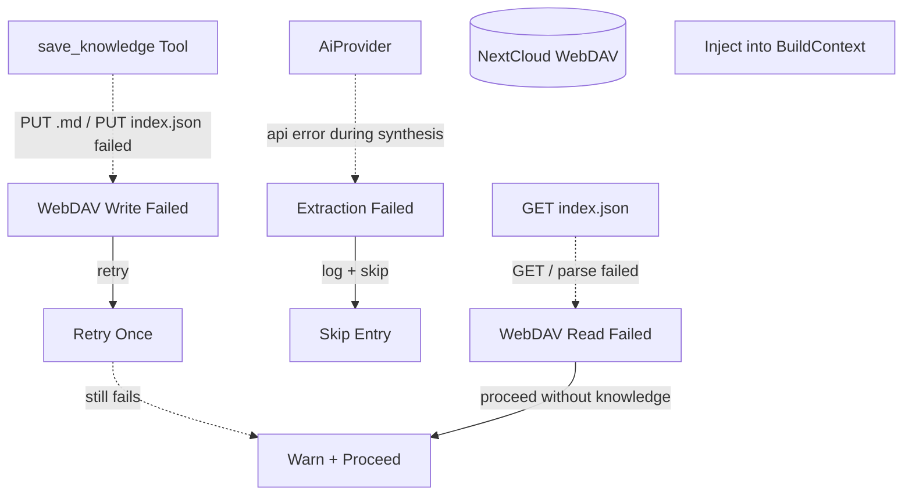

# Error Handling

## 1. Purpose

Handles failures in both directions of knowledge management: extraction failures are logged and skipped, WebDAV write failures are retried once before degrading to a warning, and index read/parse failures degrade to proceeding without knowledge.

**References:**
- [Write Flow](../write.md) — parent success path
- [Load Flow](../load.md) — parent success path
- [Shared Structures](../structures.md) — knowledge index structures

## 2. Diagram

