# Retrieval Deep Dive — Index Summary and On-Demand Recall

## 1. Purpose

Knowledge retrieval has two distinct paths:

1. **Context injection** (automatic, every turn): loads `index.json`,
   formats a compact summary, and merges it into the single leading system
   message built by `BuildContext`. No `.md`
   bodies are downloaded. The AI sees all entry titles, priorities, and
   `when_useful` descriptions.

2. **On-demand recall** (tool call): when the AI calls `recall_knowledge`
   with a query, the harness loads `index.json`, scores entries via keyword
   overlap against the query, downloads matching `.md` files, and returns
   their full content as a tool result.

**References:**
- [Load Flow](../load.md) — parent success path
- [Error Handling](./error-handling.md) — sibling failure paths

## 2. Diagram

```mermaid
flowchart TD
    subgraph CTX_INJECT["Context Injection (every turn)"]
        INIT1[refresh_knowledge_context]
        GET_IDX1["GET index.json"]
        DAV1[(NextCloud WebDAV)]
        FMT[Format Index Summary]
        SYS[Merge into Single<br/>Leading System Message]

        INIT1 --> GET_IDX1
        GET_IDX1 -->|"GET knowledge/index.json"| DAV1
        DAV1 -->|"index entries"| FMT
        FMT -->|"[P0] title — when_useful"| SYS
    end

    subgraph ON_DEMAND["On-Demand Recall (tool call)"]
        TOOL["recall_knowledge(query)"]
        GET_IDX2["GET index.json"]
        DAV2[(NextCloud WebDAV)]
        SCORE["Score entries<br/>by keyword overlap"]
        LOAD["GET matching .md files"]
        RESULT["Return full .md content<br/>as tool result"]

        TOOL --> GET_IDX2
        GET_IDX2 -->|"GET knowledge/index.json"| DAV2
        DAV2 -->|"index entries"| SCORE
        SCORE -->|"matching filenames"| LOAD
        LOAD -->|"GET each .md"| DAV2
        DAV2 -->|"markdown content"| RESULT
    end
```

