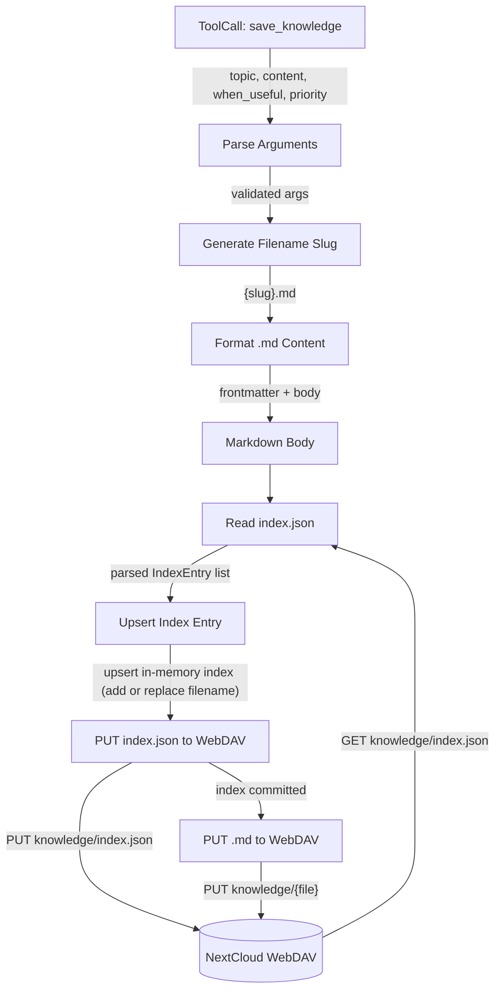

# Write Deep Dive — save_knowledge Tool

## 1. Purpose

The `save_knowledge` tool writes the index first, then the `.md` file after the index is committed. This ensures the index is always authoritative — a missing `.md` file (partial write) won't corrupt the catalog. Existence checks are performed against the in-memory index, not the WebDAV filesystem.

**References:**
- [Write Flow](../write.md) — parent success path

## 2. Diagram

