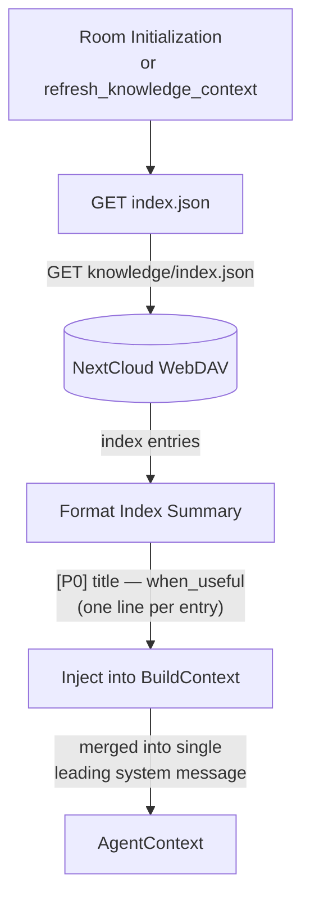

# Happy Flow — Load

## 1. Purpose

On each call to `refresh_knowledge_context`, the harness loads the room's
`index.json` from WebDAV, formats a compact summary (one line per entry:
priority, title, `when_useful`), and hands it to `BuildContext`, which merges
it into the single leading system message. No `.md` body files are downloaded
during context injection — the AI fetches full entries on demand via the
`recall_knowledge` tool.

**References:**
- [Shared Structures](structures.md) — index summary format
- [Retrieval Deep Dive](./level-2/retrieval-deep-dive.md) — context injection vs on-demand recall
- [Error Handling](./level-2/error-handling.md) — failed index loads proceed without knowledge
- [Agent Harness](../../agent/agent-harness/agent-loop.md) — knowledge index injection into agent context

## 2. Diagram

## 3. Data Structures

Shared data structures for these flows are documented in
[`structures.md`](structures.md) — see its `## 1. Overview` for
the subsystem context.
