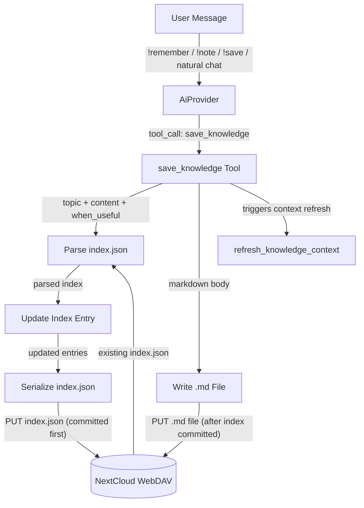

# Happy Flow — Write

## 1. Purpose

The write flow persists knowledge entries as `.md` files on WebDAV alongside a JSON `index.json`. It is triggered by explicit user commands (`!remember`, `!note`, `!save`) or autonomous agent decisions, and commits `index.json` before the `.md` file so the catalog always stays authoritative.

**References:**
- [Shared Structures](structures.md) — `KnowledgeIndex`, `IndexEntry`, markdown entry format
- [Write Deep Dive](./level-2/write-deep-dive.md) — `save_knowledge` tool internals
- [Error Handling](./level-2/error-handling.md) — write/load failure paths
- [save_knowledge Tool](../../tools/knowledge/save.md) — tool registration and parameters
- [Knowledge Priority](../knowledge-priority/priority-state.md) — `priority` field of index entries

## 2. Diagram

## 3. Data Structures

Shared data structures for these flows are documented in
[`structures.md`](structures.md) — see its `## 1. Overview` for
the subsystem context.
