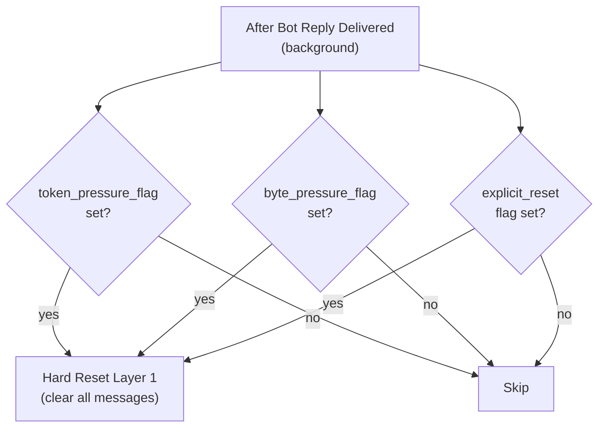
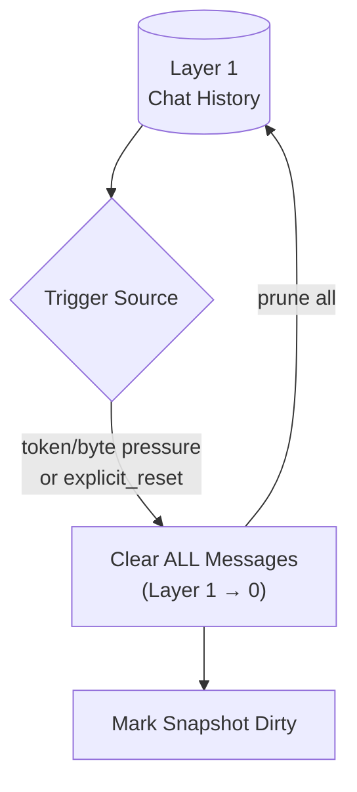
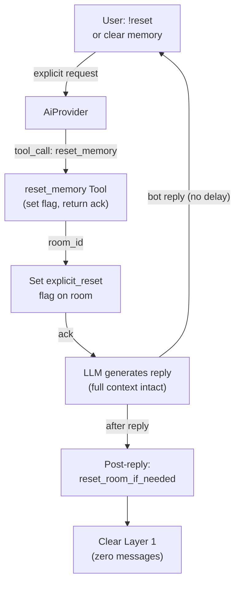
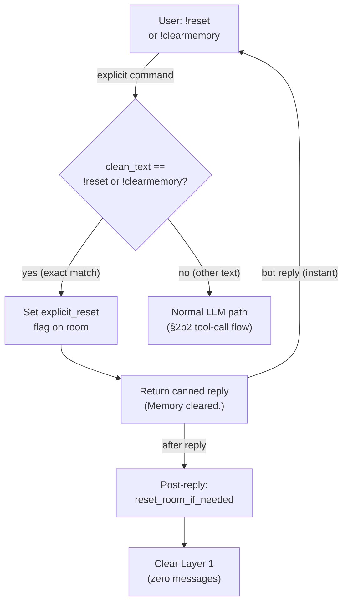
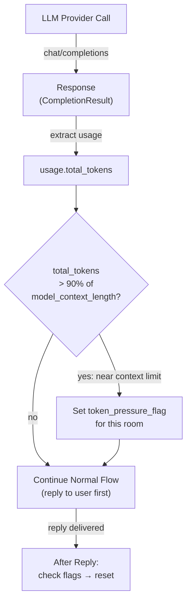
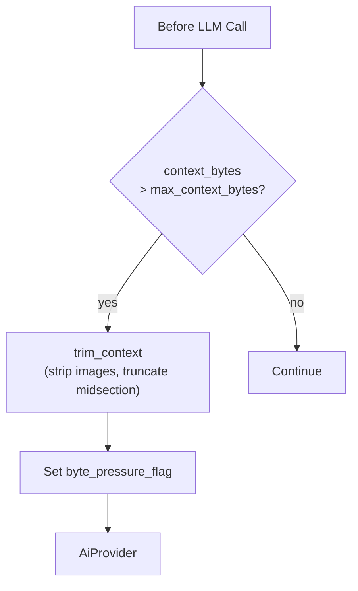
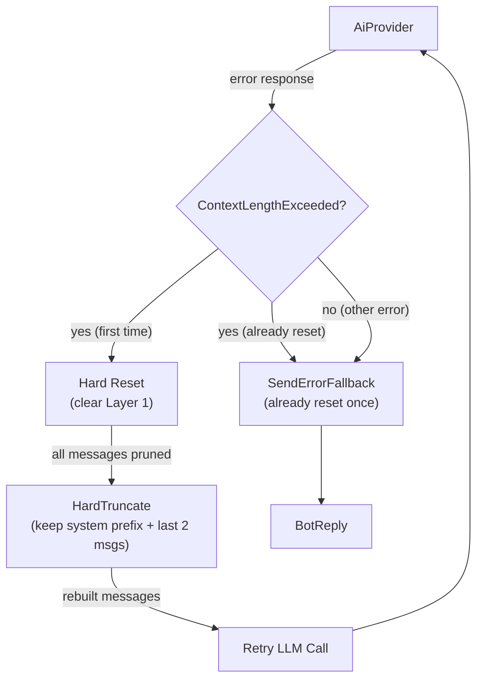

# Memory Reset

## 1. Purpose

Replaces the former LLM-based compression pipeline with a **hard reset** that
instantly clears Layer 1 (chat history) — no LLM call, no `summary.md`, no
knowledge priority review. Two automatic triggers and one user-triggered reset
all converge on the same fast in-memory operation.

- Upstream: [Memory Management](memory.md) — provides `ConversationHistory`
  (Layer 1) and the pressure flags
- Upstream: [AI Provider](ai-provider.md) — returns token usage counts for the
  post-call token trigger; may return `ContextLengthExceeded` errors
- Upstream: [Configuration Management](config.md) — provides trigger
  thresholds (`max_context_bytes`, `model_context_length`)
- Downstream: none — reset is purely in-memory (no WebDAV writes)

## 2. Diagram

### 2a. Two-Trigger Reset Decision

Both reset triggers are evaluated **after the bot reply has been delivered to
the user** — zero delay between user request and bot response. The token and
byte pressure flags are set during the LLM call and context assembly
respectively, then checked after reply delivery.

| Flag | Set During | Condition | Reset |
|------|-----------|-----------|-------|
| `token_pressure_flag` | Each LLM provider response | `usage.total_tokens > model_context_length * 0.9` | Cleared after reset completes |
| `byte_pressure_flag` | Context assembly (`trim_context`) | Serialized context bytes > `max_context_bytes` | Cleared after reset completes |
| `explicit_reset` | Pre-LLM shortcut or `reset_memory` tool call (in `process_message`) | `!reset` / `!clearmemory` exact match, or natural-language request | Cleared after reset completes |

All three flags trigger the same `reset_room_if_needed()` function after the
reply is sent. All modes clear **all** Layer 1 messages. None of the flags
block the user-facing response path.

### 2b. Hard Reset Deep Dive

When triggered, Layer 1 is cleared instantly. No LLM call, no WebDAV write,
no knowledge priority review. The snapshot is marked dirty so the next
maintenance tick persists the empty history.

Reset is an **in-memory-only** operation. No `summary.md` is created, read,
or managed. The `summary.md` concept has been removed entirely — Layer 2 no
longer exists.

### 2b2. Explicit Reset — reset_memory Tool

When the user says `!reset` or explicitly asks to clear memory, the LLM
invokes the `reset_memory` tool. The tool sets the `explicit_reset` flag on
the room and returns an acknowledgment. After the reply is delivered,
`reset_room_if_needed()` picks up the flag and clears Layer 1 instantly.

The user receives the bot's reply immediately. Reset runs after the reply is
delivered (silent — no follow-up message). See
[reset-memory.md](../tools/reset-memory.md) for the full tool flow.

### 2b3. Explicit Reset Shortcut — Pre-LLM Fast Path

When the user sends a literal `!reset` or `!clearmemory` command (exact match
after trimming), the harness detects it **before the LLM call** and returns a
canned reply immediately. No LLM round-trip, no tool call, no token cost.
The `explicit_reset` flag is set and `reset_room_if_needed()` runs post-reply
as usual — the same pipeline as §2b2, just without the LLM hop.

Natural-language reset requests ("clear my memory", "start fresh") still go
through the LLM tool-call path in §2b2 — the model handles intent detection.

**Latency**: near-zero — no provider call, no tool dispatch. Just a flag set
and a string return. The `reset_memory` tool registration is still needed for
natural-language reset requests that the LLM handles via intent detection.

### 2c. Token-Based Trigger (Post-LLM Call → Checked After Reply)

The token trigger uses the provider's actual token count. During each LLM
call, the harness inspects `response.usage.total_tokens`. If it exceeds 90%
of the configured `model_context_length`, a `token_pressure_flag` is set for
that room. The flag is checked **after the reply is delivered**, triggering
hard reset — the user never waits.

**Provider support**: all major providers return `usage` in responses. If
`usage` is absent or `total_tokens` is 0, the flag is not set (graceful
degradation).

### 2d. Safety Net — Inline Context Truncation (Pre-LLM)

**Not a reset trigger.** This is a lightweight in-memory safety mechanism
that runs immediately before each LLM call to prevent provider rejection. If
the serialized context exceeds `max_context_bytes`, older messages are
trimmed inline — no WebDAV write, no LLM call.

When inline truncation fires, it sets the `byte_pressure_flag` so the room
will receive a hard reset after the reply is delivered.

**This is fast** — no additional LLM call, no WebDAV I/O. Just in-memory
message array manipulation.

### 2e. Context-Length-Exceeded Retry — Provider-Triggered Reset

When the AI provider returns a `ContextLengthExceeded` error, the harness
runs a hard reset (clear Layer 1), hard-truncates context, and retries the
request once. No LLM summarization — just wipe and retry.

After reset, rebuilds context with `max_history: Some(4)` and applies hard
truncation: keep system/front-matter messages, only the last 2 conversation
messages. Per-message content truncation caps each remaining message at 200K
chars.

**Retry limit**: reset is attempted at most once per call. If the provider
still returns `ContextLengthExceeded` after reset, the harness falls back to
the standard error reply.

## 3. Data Structures

### `ResetResult`

Return type of `reset_room_if_needed()`. Carries the reset outcome to tests
and to the post-reply dispatch in `main.rs`.

| Field | Type | Description |
|-------|------|-------------|
| `did_reset` | `bool` | Whether any messages were actually cleared |
| `was_explicit` | `bool` | Whether reset was triggered by `explicit_reset` flag |
| `messages_cleared` | `usize` | Number of messages removed from Layer 1 |

## 4. Configuration

Fields from `ModelConfig` in [Configuration Management](config.md):

| Field                  | Type    | Default | Notes |
| ---------------------- | ------- | ------- | ----- |
| `max_context_bytes`    | `usize` | 4_000_000 | byte-size overflow trigger (pre-LLM inline trim, flag for post-reply reset) |
| `model_context_length` | `u32`   | 1_000_000 | Model's max context tokens. 90% threshold (`* 0.9`) triggers post-LLM reset. Default 1M. |

## 5. Trigger Summary

All reset triggers are evaluated **after reply delivery**. The safety net
(inline truncation) runs pre-LLM but is not a reset trigger.

| Trigger | Evaluation Point | Condition | Action |
|---------|-----------------|-----------|--------|
| **Token near-limit** | Flag set during LLM call, checked after reply | `usage.total_tokens > model_context_length * 0.9` | Hard reset (clear all L1 messages) |
| **Byte pressure** | Flag set during context assembly, checked after reply | `context_bytes > max_context_bytes` | Hard reset (clear all L1 messages) |
| **User command shortcut** | Before LLM call (early return) | `clean_text == "!reset"` or `"!clearmemory"` | Hard reset (clear all L1 messages), no LLM call |
| **User request (NL)** | Flag set by `reset_memory` tool, checked after reply | Tool called by LLM (intent detection) | Hard reset (clear all L1 messages) |
| **Safety net** | Before each LLM call | `context_bytes > max_context_bytes` | Inline trim only (strip images, truncate); sets byte_pressure_flag |
| **Provider error** | During LLM call | `ContextLengthExceeded` | Hard reset + hard truncate + retry (once) |

## 6. Integration

### With Agent Harness

| Method | Return Type | When | Action |
|--------|-------------|------|--------|
| `reset_room_if_needed()` | `Result<ResetResult>` | After reply delivery (background) | Checks flags; returns reset result |
| `check_token_pressure()` | `void` | During LLM response processing | Sets `token_pressure_flag` — does NOT block reply |
| `trim_context()` | `Vec<ChatMessage>` | Before each LLM call (safety net) | Fast in-memory trim; sets `byte_pressure_flag` |

### With Memory Manager

| Method | Purpose |
|--------|---------|
| `needs_reset(room_id)` | Returns true if any pressure or explicit flag is set |
| `clear_all_messages(room_id)` | Removes all Layer 1 messages |
| `clear_pressure_flags(room_id)` | Clears all three flags |
