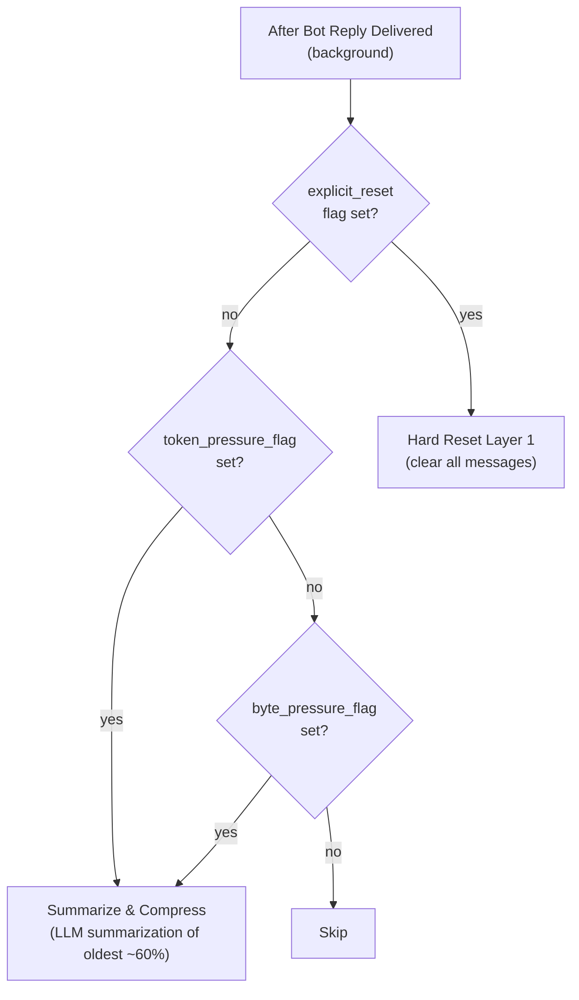
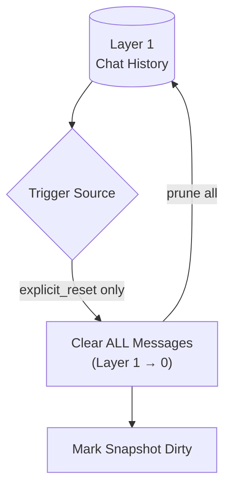
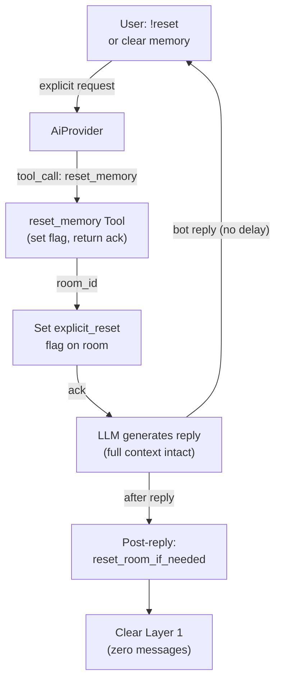
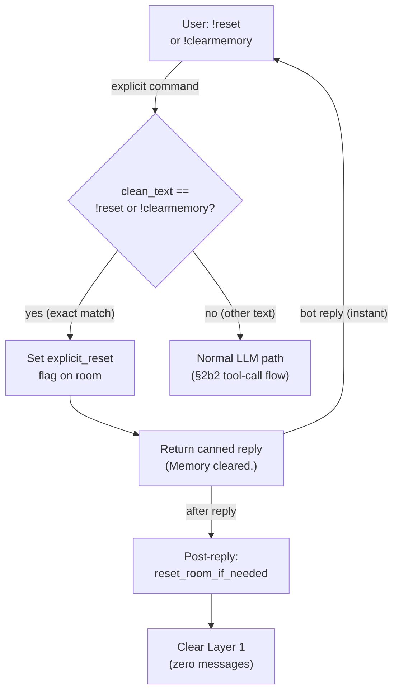
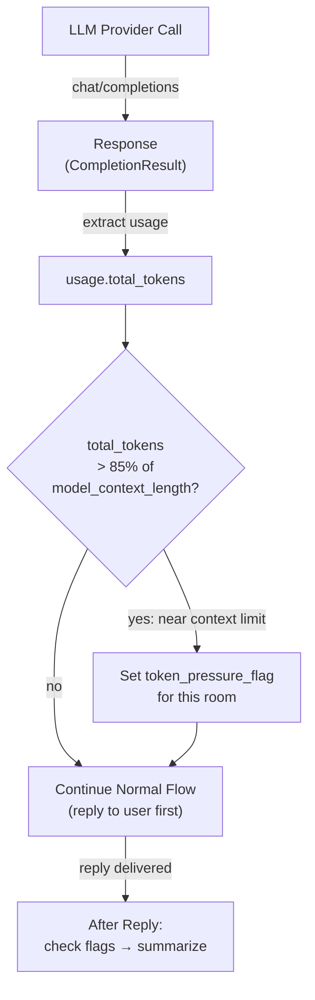
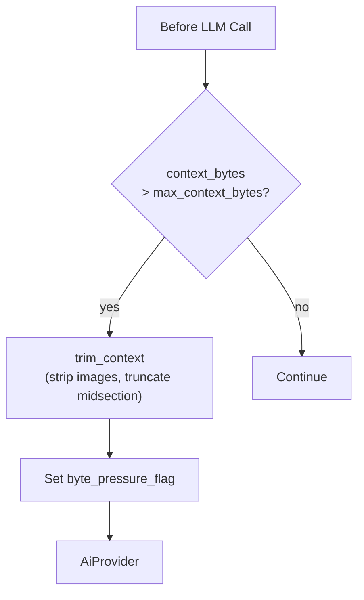
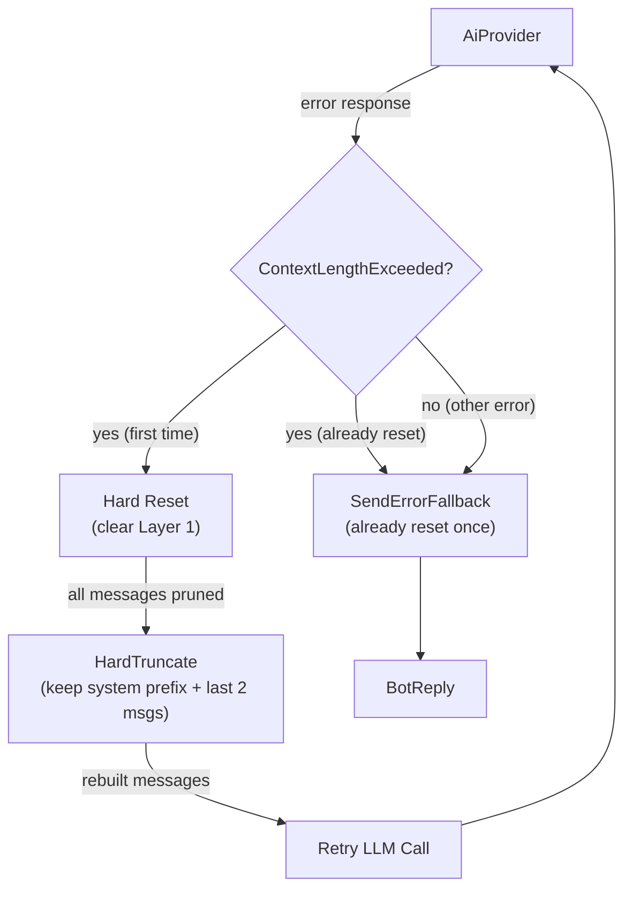
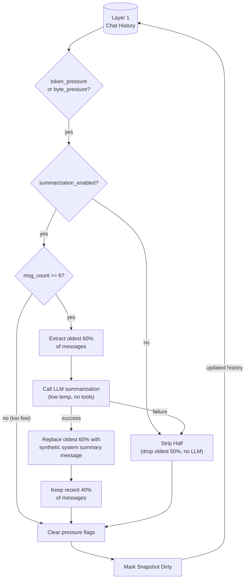

# Memory Reset

## 1. Purpose

Manages context window pressure through **LLM-based summarization** for
automatic triggers (token/byte pressure) and **hard reset** for explicit user
requests. When pressure is detected, the oldest ~60% of messages are
summarized into a compact synthetic system message by an LLM call, preserving
key context while freeing space. Explicit resets (`!reset`) still clear all
messages instantly. The former full-wipe-on-pressure and the former
`summary.md` WebDAV pipeline have both been replaced.

- Upstream: [Memory Management](memory.md) — provides `ConversationHistory`
  (Layer 1) and the pressure flags
- Upstream: [AI Provider](ai-provider.md) — returns token usage counts for the
  post-call token trigger; may return `ContextLengthExceeded` errors; used for
  summarization LLM call
- Upstream: [Configuration Management](config.md) — provides trigger
  thresholds (`max_context_bytes`, `model_context_length`,
  `summarization_enabled`, `summarization_ratio`,
  `summarization_target_tokens`)
- Downstream: none — summarization and reset are purely in-memory (no WebDAV
  writes)

## 2. Diagram

### 2a. Post-Reply Decision: Summarize vs. Hard Reset

All triggers are evaluated **after the bot reply has been delivered to the
user** — zero delay between user request and bot response. The token and
byte pressure flags route to **LLM summarization** (compress oldest messages,
keep recent). The `explicit_reset` flag routes to **hard reset** (clear all).

| Flag | Set During | Condition | Action |
|------|-----------|-----------|--------|
| `token_pressure_flag` | Each LLM provider response | `usage.total_tokens > model_context_length * 0.85` | Summarize & compress |
| `byte_pressure_flag` | Context assembly (`trim_context`) | Serialized context bytes > `max_context_bytes` | Summarize & compress |
| `explicit_reset` | Pre-LLM shortcut or `reset_memory` tool call (in `process_message`) | `!reset` / `!clearmemory` exact match, or natural-language request | Hard reset (clear all) |

`explicit_reset` is checked first — if set, hard reset runs regardless of
other flags. Token/byte pressure flags route to `summarize_and_compress()`.
None of the flags block the user-facing response path.

### 2b. Hard Reset Deep Dive (Explicit Reset Only)

When triggered by `explicit_reset`, Layer 1 is cleared instantly. No LLM
call, no WebDAV write, no knowledge priority review. The snapshot is marked
dirty so the next maintenance tick persists the empty history.

Hard reset is an **in-memory-only** operation, triggered exclusively by
`explicit_reset`. Token and byte pressure flags route to LLM summarization
(§2f) instead. No `summary.md` is created, read, or managed.

### 2b2. Explicit Reset — reset_memory Tool

When the user says `!reset` or explicitly asks to clear memory, the LLM
invokes the `reset_memory` tool. The tool sets the `explicit_reset` flag on
the room and returns an acknowledgment. After the reply is delivered,
`reset_room_if_needed()` picks up the flag and clears Layer 1 instantly.

The user receives the bot's reply immediately. Reset runs after the reply is
delivered (silent — no follow-up message). See
[reset-memory.md](../tools/reset-memory.md) for the full tool flow.

### 2b3. Explicit Reset Shortcut — Pre-LLM Fast Path

When the user sends a literal `!reset` or `!clearmemory` command (exact match
after trimming), the harness detects it **before the LLM call** and returns a
canned reply immediately. No LLM round-trip, no tool call, no token cost.
The `explicit_reset` flag is set and `reset_room_if_needed()` runs post-reply
as usual — the same pipeline as §2b2, just without the LLM hop.

Natural-language reset requests ("clear my memory", "start fresh") still go
through the LLM tool-call path in §2b2 — the model handles intent detection.

**Latency**: near-zero — no provider call, no tool dispatch. Just a flag set
and a string return. The `reset_memory` tool registration is still needed for
natural-language reset requests that the LLM handles via intent detection.

### 2c. Token-Based Trigger (Post-LLM Call → Checked After Reply)

The token trigger uses the provider's actual token count. During each LLM
call, the harness inspects `response.usage.total_tokens`. If it exceeds 85%
of the configured `model_context_length`, a `token_pressure_flag` is set for
that room. The flag is checked **after the reply is delivered**, triggering
LLM summarization — the user never waits.

**Provider support**: all major providers return `usage` in responses. If
`usage` is absent or `total_tokens` is 0, the flag is not set (graceful
degradation).

### 2d. Safety Net — Inline Context Truncation (Pre-LLM)

**Not a reset trigger.** This is a lightweight in-memory safety mechanism
that runs immediately before each LLM call to prevent provider rejection. If
the serialized context exceeds `max_context_bytes`, older messages are
trimmed inline — no WebDAV write, no LLM call.

When inline truncation fires, it sets the `byte_pressure_flag` so the room
will receive LLM summarization after the reply is delivered.

**This is fast** — no additional LLM call, no WebDAV I/O. Just in-memory
message array manipulation.

### 2e. Context-Length-Exceeded Retry — Provider-Triggered Reset

When the AI provider returns a `ContextLengthExceeded` error, the harness
runs a hard reset (clear Layer 1), hard-truncates context, and retries the
request once. No LLM summarization — just wipe and retry.

After reset, rebuilds context with `max_history: Some(4)` and applies hard
truncation: keep system/front-matter messages, only the last 2 conversation
messages. Per-message content truncation caps each remaining message at 200K
chars.

**Retry limit**: reset is attempted at most once per call. If the provider
still returns `ContextLengthExceeded` after reset, the harness falls back to
the standard error reply.

### 2f. LLM Summarization Deep Dive (Token/Byte Pressure)

When `token_pressure` or `byte_pressure` is set (and `explicit_reset` is
not), `reset_room_if_needed()` calls `summarize_and_compress()` instead of
hard reset. This runs **after the reply is delivered** — the user never
waits. The oldest ~60% of Layer 1 messages are sent to the LLM for
summarization, then replaced by a single synthetic system message. The
recent ~40% are retained intact.

**Summarization prompt**: the LLM receives a numbered list of text snippets
from the oldest messages (each capped at 500 chars, max 30 snippets). It is
instructed to preserve key decisions, user preferences, tool results, code
snippets, and important context — and to exclude greetings, chitchat,
redundant exchanges, and error recovery loops. Temperature is 0.3 for
factual output. No tools are provided.

**Summary message**: the LLM's text is wrapped as a `Role::System` message
with prefix `[Conversation Summary — earlier messages compressed]` and
inserted at position 0 of the remaining history. It persists in
`ConversationHistory` and is saved to `snapshot.json` via the existing dirty
snapshot mechanism. At context-build time, `BuildContext` absorbs this leading
system message into the single merged leading system message (system prompt +
soul + knowledge + summary) — it is never sent to the provider as a separate
system message, because strict chat templates reject any system message not at
index 0.

**Fallback**: if the LLM call fails (provider error, empty response, no
compressible text), `strip_half()` drops the oldest 50% of messages without
summarization. This is strictly better than the old full-wipe — recent
context is still retained.

**Summarization disabled**: if `summarization_enabled = false` in config,
pressure flags trigger `strip_half()` directly — no LLM call, but still
better than full wipe.

**Multi-level summarization**: on subsequent pressure cycles, any existing
summary message is included in the oldest messages extracted for
re-summarization. This naturally produces summaries-of-summaries without
special handling.

## 3. Data Structures

### `ResetResult`

Return type of `reset_room_if_needed()`. Carries the reset outcome to tests
and to the post-reply dispatch in `main.rs`.

| Field | Type | Description |
|-------|------|-------------|
| `did_reset` | `bool` | Whether any messages were actually cleared |
| `was_explicit` | `bool` | Whether reset was triggered by `explicit_reset` flag |
| `messages_cleared` | `usize` | Number of messages removed from Layer 1 |

## 4. Configuration

Fields from `ModelConfig` in [Configuration Management](config.md):

| Field                  | Type    | Default | Notes |
| ---------------------- | ------- | ------- | ----- |
| `max_context_bytes`    | `usize` | 4_000_000 | byte-size overflow trigger (pre-LLM inline trim, flag for post-reply summarization) |
| `model_context_length` | `u32`   | 1_000_000 | Model's max context tokens. 85% threshold (`* 0.85`) triggers post-LLM summarization. Default 1M. |
| `summarization_enabled` | `bool` | `true` | If `true`, token/byte pressure triggers LLM summarization. If `false`, falls back to strip-half. |
| `summarization_ratio`  | `f64`   | 0.6 | Portion of oldest messages to summarize (0.6 = 60%). Remaining 40% are retained. |
| `summarization_target_tokens` | `usize` | 1024 | Target max tokens for the summarization LLM prompt instruction. |

## 5. Trigger Summary

All triggers are evaluated **after reply delivery**. The safety net (inline
truncation) runs pre-LLM but is not a reset trigger.

| Trigger | Evaluation Point | Condition | Action |
|---------|-----------------|-----------|--------|
| **Token near-limit** | Flag set during LLM call, checked after reply | `usage.total_tokens > model_context_length * 0.85` | Summarize & compress (oldest ~60% → LLM summary) |
| **Byte pressure** | Flag set during context assembly, checked after reply | `context_bytes > max_context_bytes` | Summarize & compress (oldest ~60% → LLM summary) |
| **User command shortcut** | Before LLM call (early return) | `clean_text == "!reset"` or `"!clearmemory"` | Hard reset (clear all L1 messages), no LLM call |
| **User request (NL)** | Flag set by `reset_memory` tool, checked after reply | Tool called by LLM (intent detection) | Hard reset (clear all L1 messages) |
| **Safety net** | Before each LLM call | `context_bytes > max_context_bytes` | Inline trim only (strip images, truncate); sets byte_pressure_flag |
| **Provider error** | During LLM call | `ContextLengthExceeded` | Hard reset + hard truncate + retry (once) |

## 6. Integration

### With Agent Harness

| Method | Return Type | When | Action |
|--------|-------------|------|--------|
| `reset_room_if_needed()` | `Result<ResetResult>` | After reply delivery (background) | Checks flags; routes explicit → hard reset, pressure → summarize |
| `summarize_and_compress()` | `Result<ResetResult>` | Called by `reset_room_if_needed()` for pressure flags | LLM summarization of oldest ~60%; fallback to strip-half |
| `call_summarization_llm()` | `Result<String>` | Called by `summarize_and_compress()` | Sends summarization prompt to provider; returns summary text |
| `check_token_pressure()` | `void` | During LLM response processing | Sets `token_pressure_flag` — does NOT block reply |
| `trim_context()` | `Vec<ChatMessage>` | Before each LLM call (safety net) | Fast in-memory trim; sets `byte_pressure_flag` |

### With Memory Manager

| Method | Purpose |
|--------|---------|
| `needs_reset(room_id)` | Returns true if any pressure or explicit flag is set |
| `message_count(room_id)` | Returns number of Layer 1 messages (used for summarization threshold) |
| `oldest_messages(room_id, count)` | Returns the oldest N messages for summarization |
| `summarize_room(room_id, count, summary_msg)` | Prunes oldest N messages, inserts summary system message at position 0 |
| `strip_half(room_id)` | Drops oldest 50% of messages (fallback when summarization fails or is disabled) |
| `clear_all_messages(room_id)` | Removes all Layer 1 messages (hard reset only) |
| `clear_pressure_flags(room_id)` | Clears all three flags |
