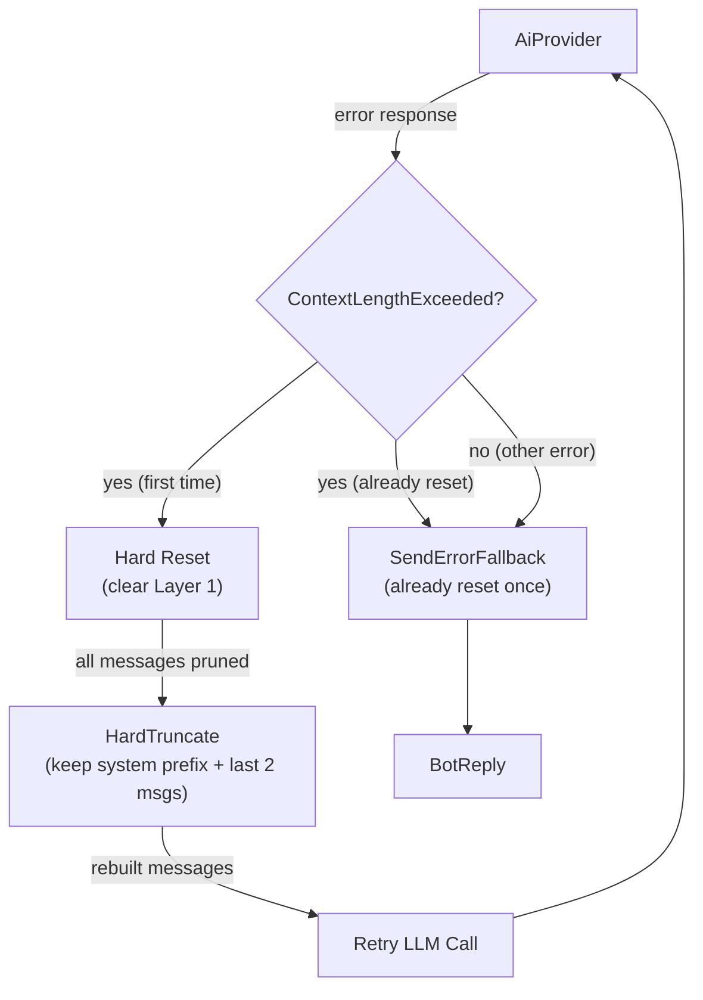

# Context-Length-Exceeded Retry — Provider-Triggered Reset

## 1. Purpose

When the AI provider returns a `ContextLengthExceeded` error, the harness
runs a hard reset (clear Layer 1), hard-truncates context, and retries the
request once. No LLM summarization — just wipe and retry.

References: [Hard Reset Deep Dive](hard-reset.md).

## 2. Diagram

After reset, rebuilds context with `max_history: Some(4)` and applies hard
truncation: keep system/front-matter messages, only the last 2 conversation
messages. Per-message content truncation caps each remaining message at 200K
chars.

**Retry limit**: reset is attempted at most once per call. If the provider
still returns `ContextLengthExceeded` after reset, the harness falls back to
the standard error reply.
