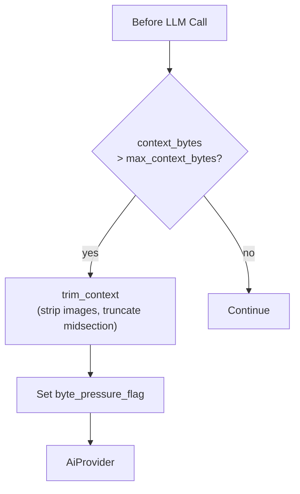

# Safety Net — Inline Context Truncation (Pre-LLM)

## 1. Purpose

**Not a reset trigger.** This is a lightweight in-memory safety mechanism
that runs immediately before each LLM call to prevent provider rejection:
if the serialized context exceeds `max_context_bytes`, older messages are
trimmed inline — no WebDAV write, no LLM call. When inline truncation fires,
it sets the `byte_pressure_flag` so the room will receive LLM summarization
after the reply is delivered.

References: [Post-Reply Decision](../post-reply-decision.md).

## 2. Diagram

**This is fast** — no additional LLM call, no WebDAV I/O. Just in-memory
message array manipulation.
