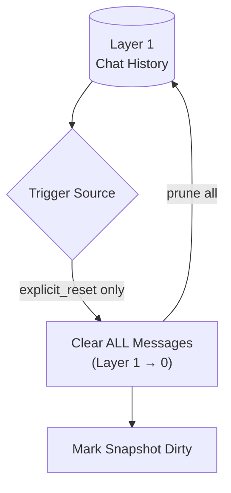

# Hard Reset Deep Dive (Explicit Reset Only)

## 1. Purpose

When triggered by `explicit_reset`, Layer 1 is cleared instantly — no LLM
call, no WebDAV write, no knowledge priority review. The snapshot is marked
dirty so the next maintenance tick persists the empty history.

References: [Post-Reply Decision](../post-reply-decision.md),
[reset_memory Tool](../reset-memory-tool.md),
[Pre-LLM Shortcut](../pre-llm-shortcut.md).

## 2. Diagram

Hard reset is an **in-memory-only** operation, triggered exclusively by
`explicit_reset`. Token and byte pressure flags route to LLM summarization
([LLM Summarization Deep Dive](summarization.md)) instead. No `summary.md`
is created, read, or managed.
