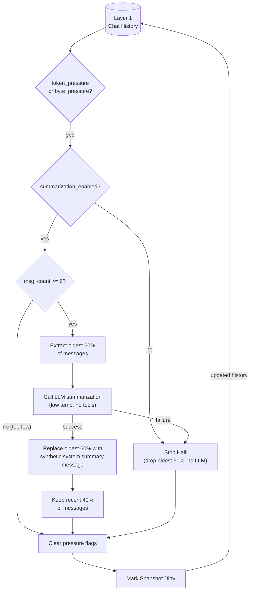

# LLM Summarization Deep Dive (Token/Byte Pressure)

## 1. Purpose

When `token_pressure` or `byte_pressure` is set (and `explicit_reset` is
not), `reset_room_if_needed()` calls `summarize_and_compress()` instead of
hard reset, running **after the reply is delivered** — the user never waits.
The oldest ~60% of Layer 1 messages are sent to the LLM for summarization,
then replaced by a single synthetic system message; the recent ~40% are
retained intact.

References: [Post-Reply Decision](../post-reply-decision.md),
[Token-Based Trigger](token-trigger.md),
[Inline Context Truncation](context-truncation.md).

## 2. Diagram

**Summarization prompt**: the LLM receives a numbered list of text snippets
from the oldest messages (each capped at 500 chars, max 30 snippets). It is
instructed to preserve key decisions, user preferences, tool results, code
snippets, and important context — and to exclude greetings, chitchat,
redundant exchanges, and error recovery loops. Temperature is 0.3 for
factual output. No tools are provided.

**Summary message**: the LLM's text is wrapped as a `Role::System` message
with prefix `[Conversation Summary — earlier messages compressed]` and
inserted at position 0 of the remaining history. It persists in
`ConversationHistory` and is saved to `snapshot.json` via the existing dirty
snapshot mechanism. At context-build time, `BuildContext` absorbs this leading
system message into the single merged leading system message (system prompt +
soul + knowledge + summary) — it is never sent to the provider as a separate
system message, because strict chat templates reject any system message not at
index 0.

**Fallback**: if the LLM call fails (provider error, empty response, no
compressible text), `strip_half()` drops the oldest 50% of messages without
summarization. This is strictly better than the old full-wipe — recent
context is still retained.

**Summarization disabled**: if `summarization_enabled = false` in config,
pressure flags trigger `strip_half()` directly — no LLM call, but still
better than full wipe.

**Multi-level summarization**: on subsequent pressure cycles, any existing
summary message is included in the oldest messages extracted for
re-summarization. This naturally produces summaries-of-summaries without
special handling.
