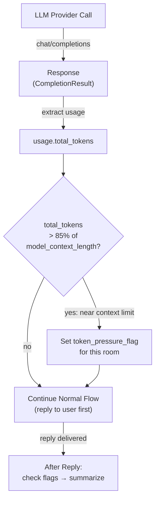

# Token-Based Trigger (Post-LLM Call → Checked After Reply)

## 1. Purpose

The token trigger uses the provider's actual token count: during each LLM
call the harness inspects `response.usage.total_tokens`, and if it exceeds
85% of the configured `model_context_length`, a `token_pressure_flag` is set
for that room and checked **after the reply is delivered**, triggering LLM
summarization — the user never waits.

References: [Post-Reply Decision](../post-reply-decision.md).

## 2. Diagram

**Provider support**: all major providers return `usage` in responses. If
`usage` is absent or `total_tokens` is 0, the flag is not set (graceful
degradation).
