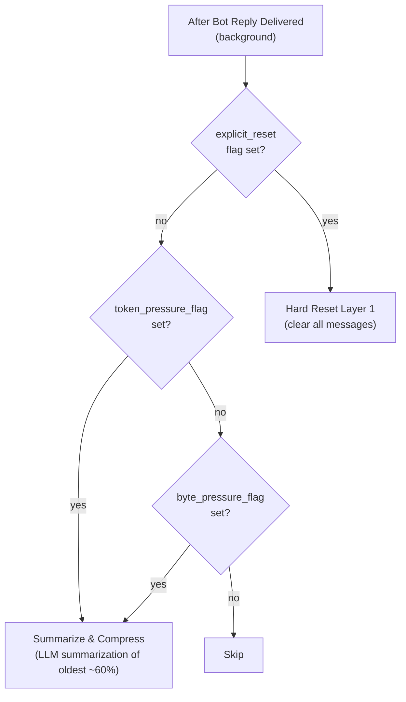

# Post-Reply Decision: Summarize vs. Hard Reset

## 1. Purpose

All triggers are evaluated **after the bot reply has been delivered to the
user** — zero delay between user request and bot response. The token and
byte pressure flags route to **LLM summarization** (compress oldest messages,
keep recent). The `explicit_reset` flag routes to **hard reset** (clear all).

References: [Hard Reset Deep Dive](level-2/hard-reset.md),
[reset_memory Tool](reset-memory-tool.md),
[Pre-LLM Shortcut](pre-llm-shortcut.md),
[Token-Based Trigger](level-2/token-trigger.md),
[Inline Context Truncation](level-2/context-truncation.md),
[Context-Length-Exceeded Retry](level-2/context-length-retry.md),
[LLM Summarization Deep Dive](level-2/summarization.md).

## 2. Diagram

| Flag | Set During | Condition | Action |
|------|-----------|-----------|--------|
| `token_pressure_flag` | Each LLM provider response | `usage.total_tokens > model_context_length * 0.85` | Summarize & compress |
| `byte_pressure_flag` | Context assembly (`trim_context`) | Serialized context bytes > `max_context_bytes` | Summarize & compress |
| `explicit_reset` | Pre-LLM shortcut or `reset_memory` tool call (in `process_message`) | `!reset` / `!clearmemory` exact match, or natural-language request | Hard reset (clear all) |

`explicit_reset` is checked first — if set, hard reset runs regardless of
other flags. Token/byte pressure flags route to `summarize_and_compress()`.
None of the flags block the user-facing response path.
