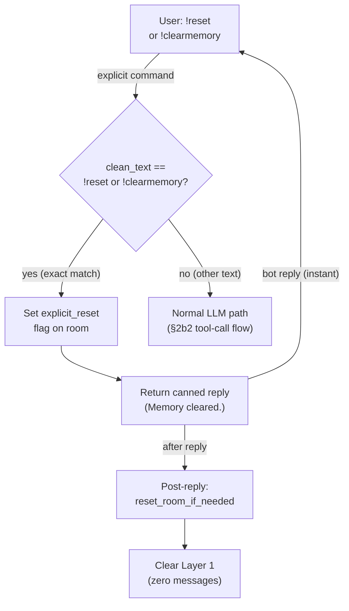

# Explicit Reset Shortcut — Pre-LLM Fast Path

## 1. Purpose

When the user sends a literal `!reset` or `!clearmemory` command (exact match
after trimming), the harness detects it **before the LLM call** and returns a
canned reply immediately. No LLM round-trip, no tool call, no token cost.
The `explicit_reset` flag is set and `reset_room_if_needed()` runs post-reply
as usual — the same pipeline as the [reset_memory tool](reset-memory-tool.md),
just without the LLM hop.

Natural-language reset requests ("clear my memory", "start fresh") still go
through the LLM tool-call path in the [reset_memory tool flow](reset-memory-tool.md)
— the model handles intent detection.

References: [Hard Reset Deep Dive](level-2/hard-reset.md),
[reset_memory Tool](reset-memory-tool.md).

## 2. Diagram

**Latency**: near-zero — no provider call, no tool dispatch. Just a flag set
and a string return. The `reset_memory` tool registration is still needed for
natural-language reset requests that the LLM handles via intent detection.
