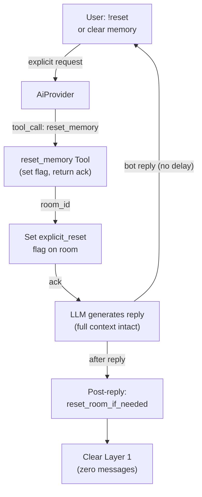

# Explicit Reset — reset_memory Tool

## 1. Purpose

When the user says `!reset` or explicitly asks to clear memory, the LLM
invokes the `reset_memory` tool. The tool sets the `explicit_reset` flag on
the room and returns an acknowledgment. After the reply is delivered,
`reset_room_if_needed()` picks up the flag and clears Layer 1 instantly.

References: [Hard Reset Deep Dive](level-2/hard-reset.md),
[Pre-LLM Shortcut](pre-llm-shortcut.md).

## 2. Diagram

The user receives the bot's reply immediately. Reset runs after the reply is
delivered (silent — no follow-up message). See
[reset-memory.md](../../tools/reset-memory/flag-driven.md) for the full tool flow.
