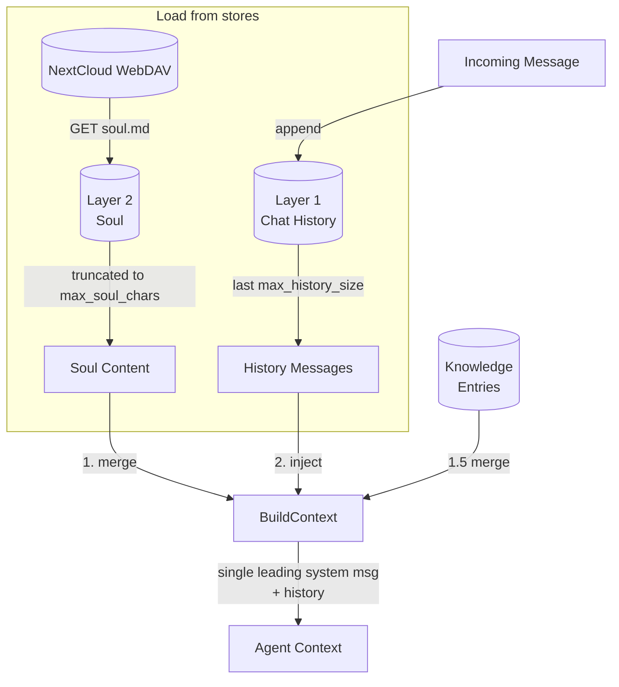
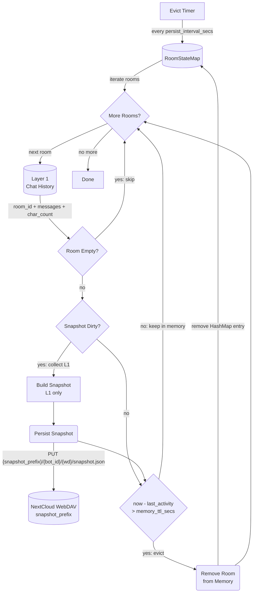
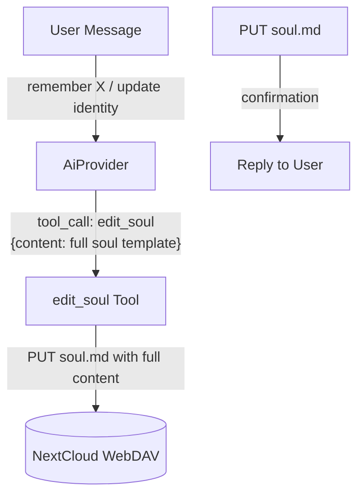
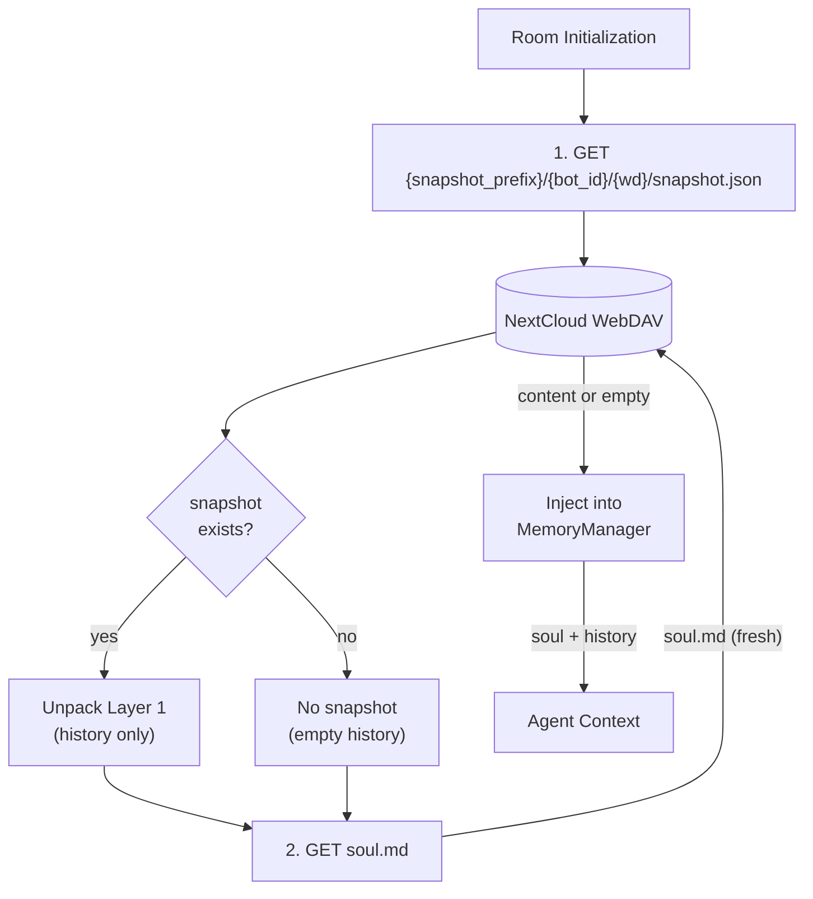
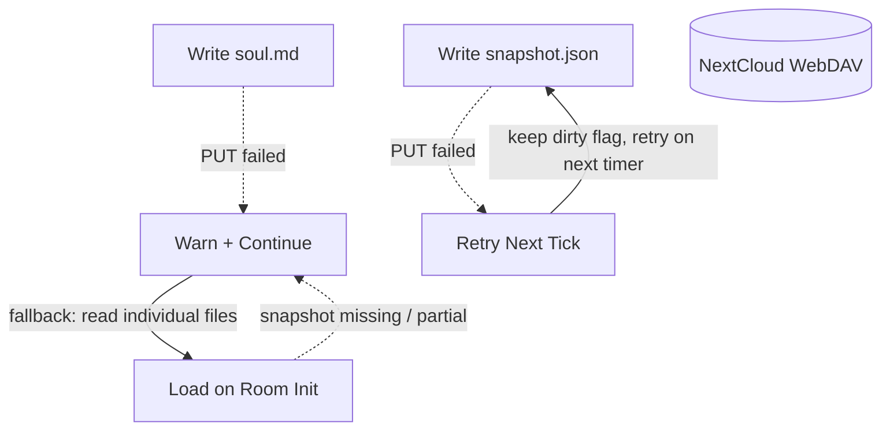
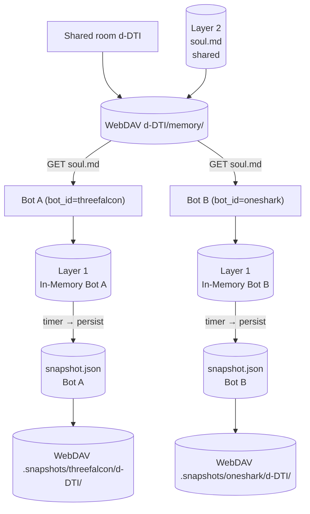

# Memory Management

## 1. Purpose

Two-layer per-room conversation memory. Rooms stay in memory while actively
communicating and are evicted after a configurable idle TTL — the snapshot is
persisted to WebDAV before eviction, then restored on next interaction.

**Soul** is re-read from WebDAV on every single message (not cached), exactly
like the knowledge index. The snapshot stores only Layer 1 (conversation
history) — it is **bot-internal data** written to a separate WebDAV prefix
(`{snapshot_prefix}/{bot_id}/{wd}/snapshot.json`), isolated per bot instance.
Soul is always fetched from its individual file in the shared room folder.
This ensures zero staleness when multiple bot instances share the same
WebDAV room folder.

| Layer | Name | Storage | Limit | Contents |
|-------|------|---------|-------|----------|
| 1 | **Chat History** | In-memory only | Hardcoded cap on messages | Raw `Vec<ChatMessage>` — the current working window |
| 2 | **Soul** | WebDAV `soul.md` file | `max_soul_chars` chars | Persistent core memory editable by user via chat |

When Layer 1 overflows (token or byte pressure), it is compressed via LLM
summarization — the oldest ~60% of messages are summarized into a synthetic
system message, and the recent ~40% are retained. Explicit user requests
(`!reset`) still trigger a hard reset (clear all). The full pipeline —
including triggers, the `reset_memory` tool, and the `ContextLengthExceeded`
recovery path — is documented in [Memory Reset](memory-reset.md).

- Upstream: [Configuration Management](config.md) provides `ModelConfig`
  (`max_text_length`, `max_history_size`, `max_soul_chars`,
  `memory_ttl_secs`, `persist_interval_secs`, `max_context_bytes`,
  `model_context_length`)
- Upstream: [Agent Harness](../agent/agent-harness.md) triggers
  `reset_room_if_needed` after each message, `persist_room_snapshots` on a
  periodic timer, `restore_history` on room init, and handles `edit_soul`
  tool calls
- Downstream: [Memory Reset](memory-reset.md) — reset and summarization
  pipeline (triggers, flag clearing, Layer 1 compress/clear)
- Downstream: WebDAV crate (`WebDavClient`, `WebDavPath`) persists
  snapshots and `soul.md`
- Downstream: [Knowledge Management](knowledge.md) — separate system for
  categorized skill/secret/note entries (not part of the two-layer memory)

## 2. Diagram

### 2a. Happy Flow — Retrieve from Two Layers

On each interaction, data from both layers is retrieved (with configurable
limits) and injected into the agent context. Write flows (persist, soul edit)
are shown in separate sub-diagrams.



**Single leading system message invariant**: `BuildContext` emits **exactly
one** system message at index 0. The system prompt, soul block, knowledge
index summary, and any leading `Role::System` summary message from history
(the `[Conversation Summary …]` output of LLM summarization) are merged into
that single message, joined by `\n\n`. This is required by strict chat
templates (e.g. Qwen3.5/3.6-derived, used by Bonsai-27B) that reject any
system message not at index 0 with a 400 error — see Gitea issue #77.

Layer 1 is populated by incoming messages. Layer 2 is populated by the
[Soul Editing](#2d-happy-flow--soul-editing) tool. The [Persist & Evict
Flow](#2c-persist--evict-flow--timer) provides crash recovery for Layer 1
and TTL-based room eviction.

### 2b. Reset Flow — Layer 1 Hard Reset (Overflow)

Hard reset pipeline (triggers, flag clearing, Layer 1 clear) is documented
in [Memory Reset](memory-reset.md).

### 2c. Persist & Evict Flow — Timer

A single periodic timer handles both crash-recovery snapshot persistence and
TTL-based eviction. The snapshot stores only Layer 1 (conversation history) —
it is bot-internal data written to a separate prefix
(`{snapshot_prefix}/{bot_id}/{wd}/snapshot.json`), isolated per bot instance.
After persisting, rooms idle longer than `memory_ttl_secs` are saved and
removed from the in-memory map.

When Layer 1 changes (new message, reset), the snapshot is marked dirty
and rebuilt on the next timer tick — writes are coalesced to avoid thrashing
WebDAV. Soul changes do NOT mark the snapshot dirty — soul is shared room
data stored in its own file.



### 2d. Happy Flow — Soul Editing



### 2e. Restore Flow — Snapshot for History Only (Room Init)

Snapshot stores only Layer 1 (conversation history) for crash recovery.
It is read from the bot-internal prefix
(`{snapshot_prefix}/{bot_id}/{wd}/snapshot.json`), isolated per bot instance.
Soul is always fetched fresh from its individual file in the shared room folder.



Knowledge entries are also restored during room init — see [Knowledge Management](knowledge.md).

Key properties:
- **History-only snapshot**: snapshot stores only Layer 1 (chat history) — soul is always fetched from its dedicated file
- **Bot-internal isolation**: snapshot is written under `{snapshot_prefix}/{bot_id}/{wd}/`, separate from the shared room folder — two bot instances sharing the same room never clobber each other's snapshot
- **No staleness**: every message re-reads soul.md from WebDAV, ensuring multi-instance consistency
- **No snapshot blocking**: if snapshot write fails, the system continues operating — next timer tick retries

### 2f. Error Handling



### 2g. Memory Partitioning

Each room gets isolated two-layer memory. Shared room data (`soul.md`) lives
under the room's WebDAV directory. Bot-internal snapshot data lives under a
separate prefix, namespaced by `bot_id`, so two bot instances sharing the
same room never clobber each other's snapshot.



## 3. Data Structures

All structs live in `crate-rockbot/src/memory.rs` unless noted.

### `PersistSnapshot` (WebDAV checkpoint — bot-internal)

A single JSON file stored at `{root}/{snapshot_prefix}/{bot_id}/{webdav_dir}/snapshot.json`.
One file per bot instance per room. Stores only Layer 1 (conversation history)
for crash recovery. Soul and summary are NOT stored in the snapshot — they are
shared room data, always read from their individual files.

| Field              | Type                    | Notes                                                  |
| ------------------ | ----------------------- | ------------------------------------------------------ |
| `schema`           | `NonEmptyString`        | `"rockbot-snapshot/1"` version marker (validated at JSON boundary) |
| `room_id`          | `NonEmptyString`        | Platform room identifier (Matrix room ID or RocketChat room ID) |
| `messages`         | `Vec<ChatMessage>`      | Raw Layer 1 messages (in-memory buffer)                |
| `char_count`       | `usize`                 | Running Layer 1 character count                        |
| `soul`             | `Option<String>`        | Deprecated — always `None` in new writes; ignored on read. Retained in struct for deserialization compatibility with old snapshots. |
| `summary`          | `Option<String>`        | Deprecated — always `None` in new writes; ignored on read. Retained in struct for deserialization compatibility with old snapshots. |
| `updated_at`       | `String`                | ISO 8601 timestamp of last write                       |

Rebuilt when Layer 1 changes (new message, reset). Written on the
periodic persist timer (coalesced — not on every individual change). The
`snapshot_prefix` is configurable via `[webdav] snapshot_prefix` (default
`.snapshots`), isolating bot-internal data from the shared room folder.

### `MemoryManager`

| Field                  | Type                         | Notes                                    |
| ---------------------- | ---------------------------- | ---------------------------------------- |
| `rooms`                | `HashMap<String, RoomState>` | Per-room state map                       |
| `max_chars`            | `usize`                      | Reset threshold (max_text_length)        |
| `max_history_messages` | `usize`                      | Layer 1 message count limit for context  |
| `max_soul_chars`       | `usize`                      | Layer 2 max chars for soul.md content    |
| `souls`                | `HashMap<String, SoulMemory>`| Layer 2 in-memory holder (refreshed from WebDAV before each message — never stale) |
| `dirty_snapshots`      | `HashSet<String>`            | Room IDs needing snapshot rebuild        |
| `knowledge`            | `HashMap<String, String>`    | Knowledge index summary per room          |
| `persist_interval_secs`| `u64`                        | Timer interval for writing snapshots (default 60) |
| `max_context_bytes`    | `usize`                      | Byte limit that triggers inline trim and post-reply reset (default 4MB ≈ 1M tokens) |

### `RoomState`

| Field           | Type                  | Notes                                         |
| --------------- | --------------------- | --------------------------------------------- |
| `room_id`       | `String`              | RocketChat room UUID                          |
| `room_name`     | `String`              | URL slug (ASCII)                              |
| `room_fname`    | `String`              | Friendly display name (Unicode); **must be non-empty** — `compute_webdav_dir` panics if absent (no fallback to `room_name`) |
| `is_dm`         | `bool`                | Direct message flag                           |
| `history`       | `ConversationHistory` | Layer 1: in-memory buffer                     |
| `last_activity` | `u64`                 | Unix timestamp of last interaction; checked against `memory_ttl_secs` for eviction |

### `ConversationHistory` (Layer 1)

| Field              | Type               | Notes                                |
| ------------------ | ------------------ | ------------------------------------ |
| `room_id`          | `String`           | Owning room identifier               |
| `messages`         | `Vec<ChatMessage>` | In-memory message buffer             |
| `char_count`       | `usize`            | Running character count              |

### `SoulMemory` (Layer 2)

A single file stored at `{root}/{webdav_dir}/memory/soul.md`.

```rust
struct SoulMemory {
    room_id: NonEmptyString,
    content: String,      // Full markdown content of soul.md
    updated_at: String,   // ISO 8601
}
```

The `content` is a flat enumeration list — each line is a `-` bullet item.
The first item always starts with `My name is ...`, used for display name
extraction via regex `My name is (.+)`. The `edit_soul` tool overwrites the
entire file.

### File Layout

Shared room data is stored per-room under the prefixed `webdav_dir` key (see
[rocketchat.md](rocketchat.md) for naming conventions — `r-` for channels,
`d-` for DMs, using `room_fname` exclusively). `compute_webdav_dir` panics if
`room_fname` is empty — no fallback to `room_name`. Bot-internal snapshot data
is stored under a separate configurable prefix, namespaced by `bot_id`.

```
{root}/{webdav_dir}/memory/
└── soul.md                     # Layer 2: permanent core memory (shared)

{root}/{snapshot_prefix}/{bot_id}/{webdav_dir}/
└── snapshot.json               # Layer 1: bot-internal crash-recovery checkpoint
```

Example with `snapshot_prefix = ".snapshots"`, two bots sharing room `d-DTI`:
```
CLAW/d-DTI/memory/soul.md                          # shared soul
CLAW/.snapshots/threefalcon/d-DTI/snapshot.json    # falcon's history only
CLAW/.snapshots/oneshark/d-DTI/snapshot.json       # shark's history only
```

## 4. Configuration

Fields from `ModelConfig` in [Configuration Management](config.md):

| Field                  | Type    | Default | Notes                                              |
| ---------------------- | ------- | ------- | -------------------------------------------------- |
| `max_soul_chars`       | `usize` | 2000    | Layer 2 max chars for soul.md content              |
| `memory_ttl_secs`      | `u64`   | 300     | Room idle timeout — evict from memory (after snapshot persisted) |
| `persist_interval_secs`| `u64`   | 60      | How often the timer writes dirty snapshots to WebDAV |
| `max_context_bytes`    | `usize` | 4_000_000 | Max byte size for context (triggers inline trim + post-reply summarization flag) |
| `model_context_length` | `u32`   | 1_000_000 | Model's max context tokens; 85% threshold triggers post-LLM summarization |

Field from `WebDavConfig` in [Configuration Management](config.md):

| Field                  | Type    | Default      | Notes                                              |
| ---------------------- | ------- | ------------ | -------------------------------------------------- |
| `snapshot_prefix`      | `String`| `.snapshots` | WebDAV path prefix for bot-internal snapshot storage; isolates snapshot.json from shared room folder |

## 5. Integration with Agent Harness

### Triggers

| Trigger             | Method                        | Frequency                      | Condition                                                    | Action                                        |
| ------------------- | ----------------------------- | ------------------------------ | ------------------------------------------------------------ | --------------------------------------------- |
| **Timer persist**   | `maintenance_tick()` (Phase 1) | Every `persist_interval_secs`  | `dirty_snapshots` is non-empty                               | Build snapshot (L1 only), PUT `{snapshot_prefix}/{bot_id}/{wd}/snapshot.json`, clear dirty flag |
| **Timer evict**     | `maintenance_tick()` (Phase 2) | Every `persist_interval_secs`  | Room has ≥ 1 message AND `last_activity > 0` AND `now - last_activity > memory_ttl_secs` | Persist snapshot if dirty, then remove room from `HashMap` |
| **Reset**           | `reset_room_if_needed()`       | After reply delivered (background)  | Checks flags (token pressure, byte pressure, explicit) | See [Memory Reset](memory-reset.md) |
| **Safety net**      | `trim_context()`               | Before each LLM call           | `context_bytes > max_context_bytes`                              | Inline trim only; sets byte_pressure_flag. See [Memory Reset](memory-reset.md §2d) |
| **Soul refresh**    | `process_message()`            | On every incoming message      | WebDAV configured (always)                                  | Re-read `soul.md` from WebDAV, update in-memory holder |
| **Room init**       | `restore_history()`            | Once per room, on first message| Room not in memory (fresh or evicted)                        | Load snapshot from `{snapshot_prefix}/{bot_id}/{wd}/snapshot.json` for history, always read soul from individual file |
| **Soul edit**       | `edit_soul()` tool             | On user request                | LLM invokes `edit_soul` tool                                 | Write `soul.md`, update in-memory soul, mark snapshot dirty |
| **Touch activity**  | `process_message()`            | On every incoming message      | Room exists in memory                                        | Update `last_activity` timestamp to prevent eviction |

### Tool: `edit_soul`

| Parameter       | Type     | Description                                    |
| --------------- | -------- | ---------------------------------------------- |
| `content`       | `string` | Full soul.md content using the standard template (`# Soul Memory\n\n- My name is Name ✨\n- ...\n- ...`) |

### Context Injection Order

On every message, soul is re-read from WebDAV (fresh) and injected into
the agent context in this order (room init additionally restores history
from snapshot):

```
1. single system message  (merged: system prompt + soul.md content + knowledge index + leading conversation summary, joined by "\n\n")
2. chat history           (Layer 1 — last max_history_size messages, minus any leading system summary absorbed into 1.)
```

The merge into one leading system message is a hard invariant (strict chat
templates reject non-leading system messages). Knowledge entries are merged
into the same system message between soul and summary (see
[Knowledge Management](knowledge.md)).

### Reset Lifecycle

See [Memory Reset](memory-reset.md) for the full reset pipeline — triggers,
flag clearing, and the `ContextLengthExceeded` recovery path.

| Step               | Harness method                     | Notes                                              |
| ------------------ | ---------------------------------- | -------------------------------------------------- |
| Timer persist      | `maintenance_tick()` (Phase 1)     | Called every `persist_interval_secs`; writes dirty snapshot to `{snapshot_prefix}/{bot_id}/{wd}/snapshot.json` |
| Timer evict        | `maintenance_tick()` (Phase 2)     | Called every `persist_interval_secs`; persists snapshot then removes stale rooms |
| Room init          | `restore_history()`                | Cache-first: reads `{snapshot_prefix}/{bot_id}/{wd}/snapshot.json`, always reads soul from individual file |
| Soul edit          | `edit_soul()` tool                 | Writes soul.md, updates in-memory, marks snapshot dirty |
| Touch activity     | `process_message()`                | Updates `last_activity` on every incoming message   |
| Context injection  | `MemoryManager::build_context()`   | Prepend soul + history                             |
