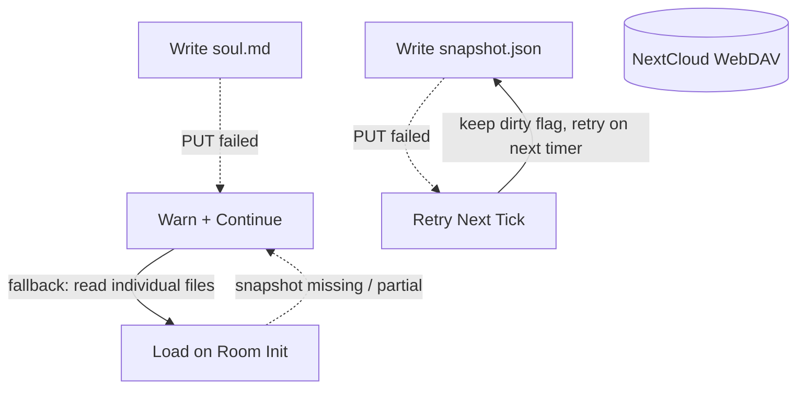

# Error Handling

## 1. Purpose

Failure paths for snapshot persistence, soul writes, and room-init loads:
failed snapshot writes keep the dirty flag and retry on the next timer tick;
failed soul writes and missing/partial snapshots warn and continue operating.

References: ../persist-evict.md, ../restore-room.md, ../soul-editing.md

## 2. Diagram

