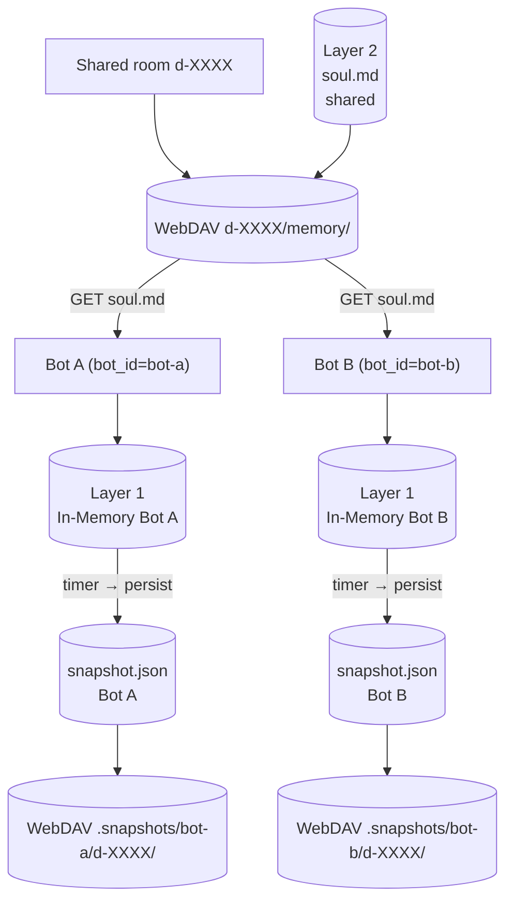

# Memory Partitioning

## 1. Purpose

Each room gets isolated two-layer memory. Shared room data (`soul.md`) lives
under the room's WebDAV directory. Bot-internal snapshot data lives under a
separate prefix, namespaced by `bot_id`, so two bot instances sharing the
same room never clobber each other's snapshot.

## 2. Diagram

## 3. Data Structures

Shared data structures for these flows are documented in
[`structures.md`](structures.md) — see its `## 1. Overview` for
the subsystem context.
