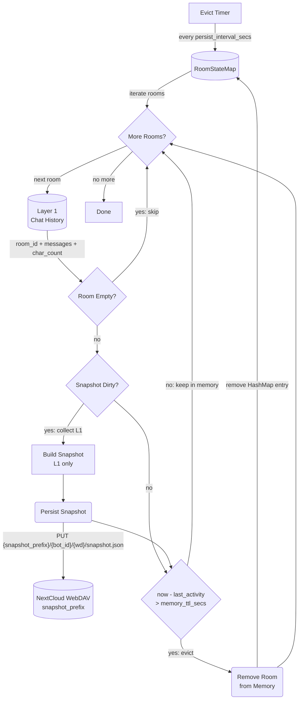

# Persist & Evict

## 1. Purpose

A single periodic timer handles both crash-recovery snapshot persistence and
TTL-based eviction. The snapshot stores only Layer 1 (conversation history) —
it is bot-internal data written to a separate prefix
(`{snapshot_prefix}/{bot_id}/{wd}/snapshot.json`), isolated per bot instance.
After persisting, rooms idle longer than `memory_ttl_secs` are saved and
removed from the in-memory map.

When Layer 1 changes (new message, reset), the snapshot is marked dirty
and rebuilt on the next timer tick — writes are coalesced to avoid thrashing
WebDAV. Soul changes do NOT mark the snapshot dirty — soul is shared room
data stored in its own file.

## 2. Diagram

## 3. Data Structures

Shared data structures for these flows are documented in
[`structures.md`](structures.md) — see its `## 1. Overview` for
the subsystem context.
