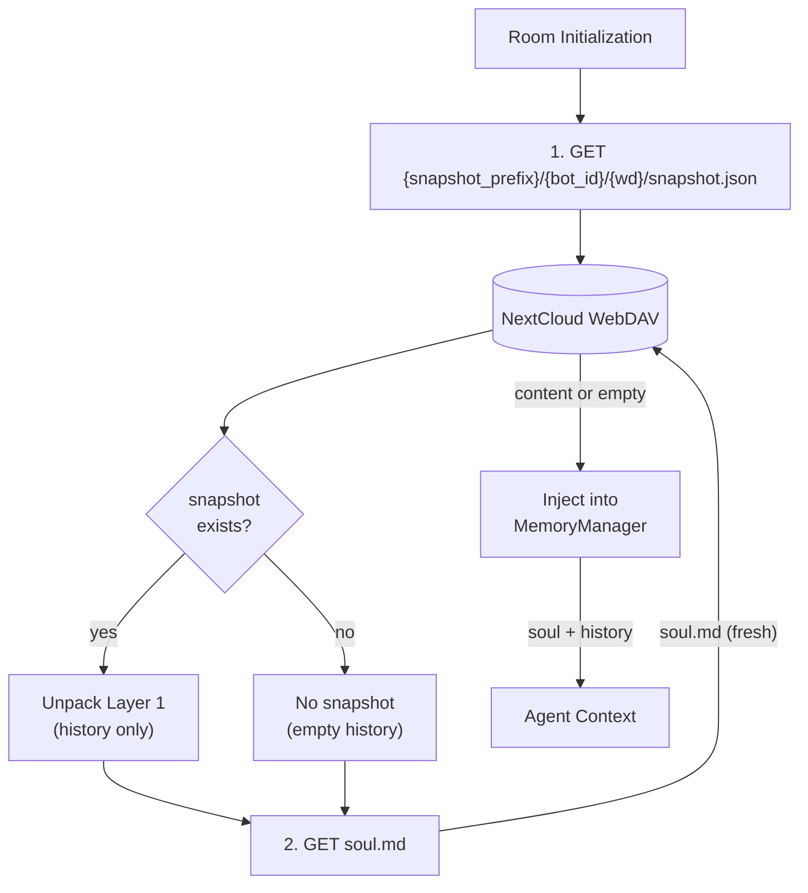

# Restore Flow — Snapshot for History Only

## 1. Purpose

Snapshot stores only Layer 1 (conversation history) for crash recovery.
It is read from the bot-internal prefix
(`{snapshot_prefix}/{bot_id}/{wd}/snapshot.json`), isolated per bot instance.
Soul is always fetched fresh from its individual file in the shared room folder.

## 2. Diagram

Knowledge entries are also restored during room init — see [Knowledge Management](../../knowledge/knowledge/write.md).

Key properties:
- **History-only snapshot**: snapshot stores only Layer 1 (chat history) — soul is always fetched from its dedicated file
- **Bot-internal isolation**: snapshot is written under `{snapshot_prefix}/{bot_id}/{wd}/`, separate from the shared room folder — two bot instances sharing the same room never clobber each other's snapshot
- **No staleness**: every message re-reads soul.md from WebDAV, ensuring multi-instance consistency
- **No snapshot blocking**: if snapshot write fails, the system continues operating — next timer tick retries

## 3. Data Structures

Shared data structures for these flows are documented in
[`structures.md`](structures.md) — see its `## 1. Overview` for
the subsystem context.
