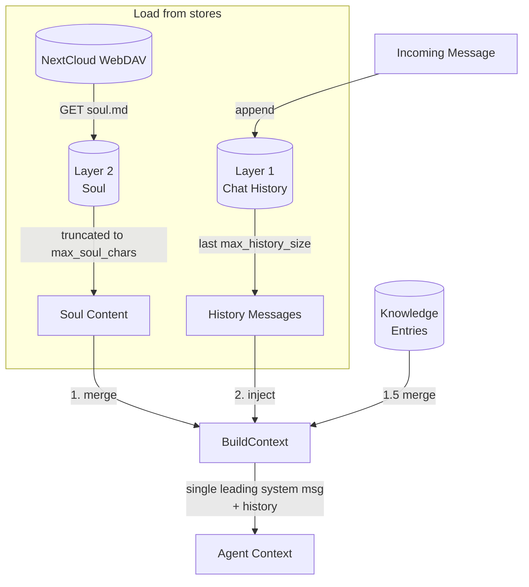

# Retrieve from Two Layers

## 1. Purpose

On each interaction, data from both layers is retrieved (with configurable
limits) and injected into the agent context. Write flows (persist, soul edit)
are shown in separate sub-diagrams.

## 2. Diagram

**Single leading system message invariant**: `BuildContext` emits **exactly
one** system message at index 0. The system prompt, soul block, knowledge
index summary, and any leading `Role::System` summary message from history
(the `[Conversation Summary …]` output of LLM summarization) are merged into
that single message, joined by `\n\n`. This is required by strict chat
templates (e.g. Qwen3.5/3.6-derived, used by Bonsai-27B) that reject any
system message not at index 0 with a 400 error — see Gitea issue #77.

Layer 1 is populated by incoming messages. Layer 2 is populated by the
[Soul Editing](soul-editing.md) tool. The [Persist & Evict
Flow](persist-evict.md) provides crash recovery for Layer 1 and TTL-based room
eviction.

## 3. Data Structures

Shared data structures for these flows are documented in
[`structures.md`](structures.md) — see its `## 1. Overview` for
the subsystem context.
