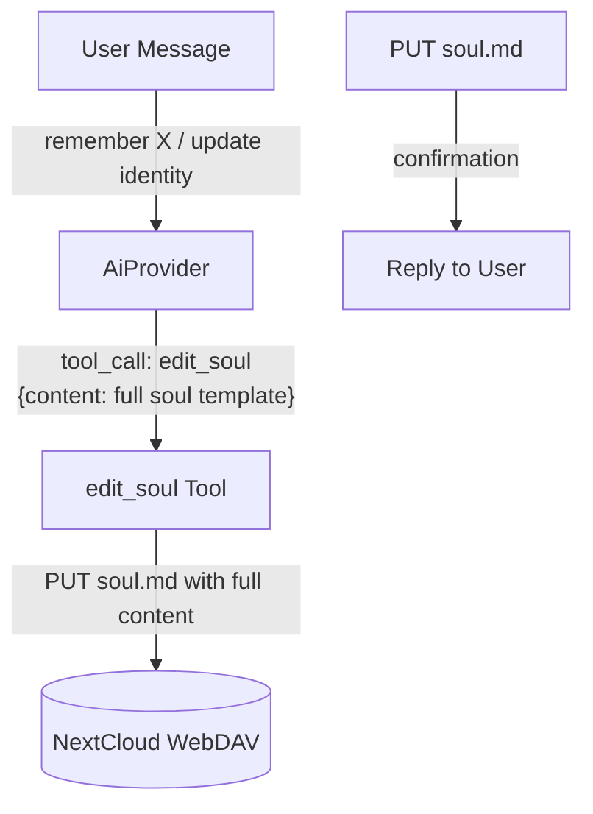

# Soul Editing

## 1. Purpose

When the user asks to remember something or update the persona in chat, the
LLM invokes the `edit_soul` tool with the full soul template as `content`. The
tool overwrites `soul.md` on WebDAV and confirms to the user.

## 2. Diagram

## 3. Data Structures

Shared data structures for these flows are documented in
[`structures.md`](structures.md) — see its `## 1. Overview` for
the subsystem context.
