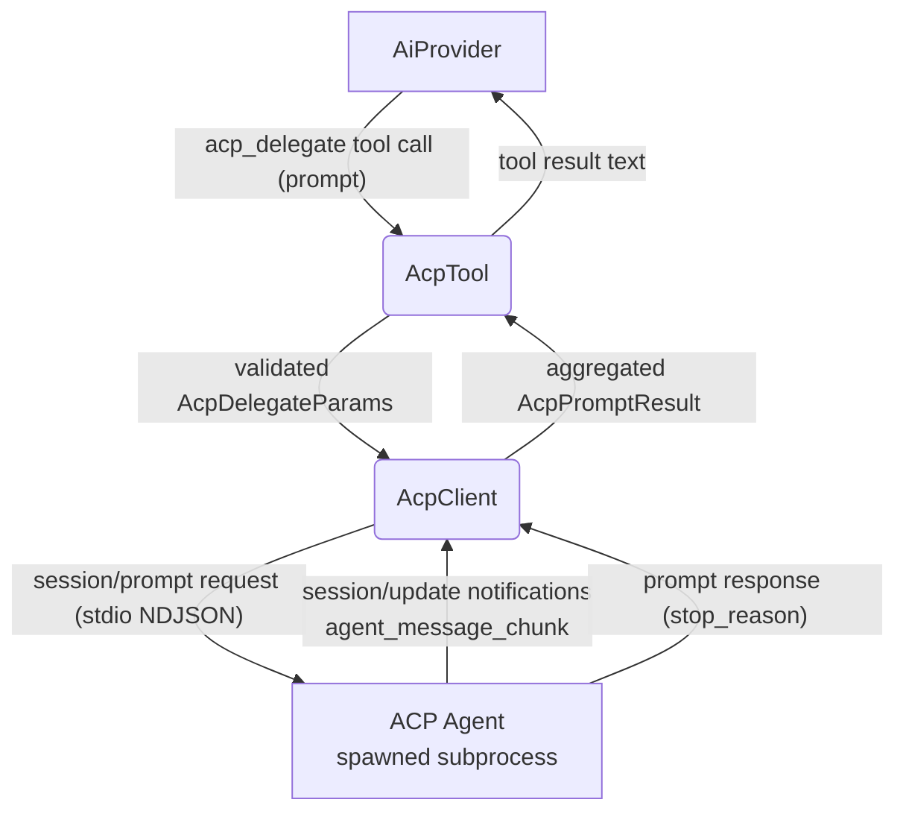
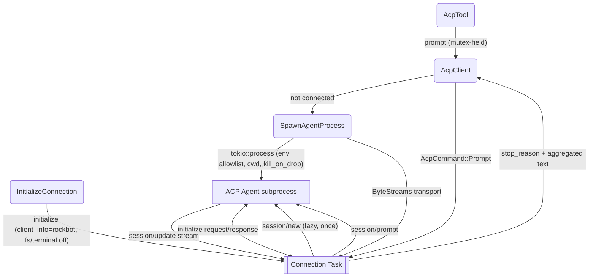
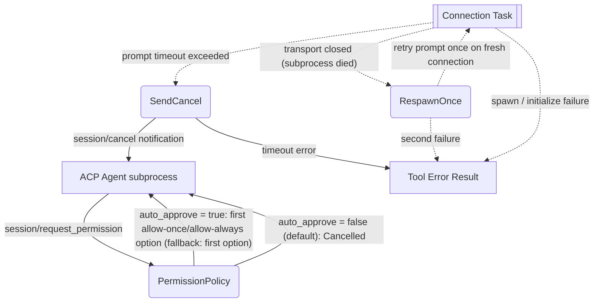

# ACP Delegate

## 1. Purpose

Delegates a natural-language task to an external ACP (Agent Client Protocol)
agent — e.g. `opencode acp`, `codex-acp` — spawned by RockBot as a subprocess
over stdio (NDJSON JSON-RPC 2.0), and returns the agent's aggregated text
output as a tool result to the LLM.

- Upstream: [Configuration Management](../infra/config.md) provides `AcpConfig`
  (`[acp]` section; disabled by default)
- Upstream: [Agent Harness](../agent/agent-harness.md) invokes `acp_delegate`
  as a tool during the agent loop
- Downstream: [AI Provider](../ai/ai-provider.md) consumes the returned agent
  output for chat completions

Wire types come from the official Rust SDK (`agent-client-protocol` v2,
`agent_client_protocol::schema::v1`). All SDK usage is encapsulated in
`acp.rs` (`AcpClient`); `tools/acp.rs` (`AcpTool`) only validates params and
forwards the prompt string.

## 2. Diagram

### 2a. Happy Flow (Main Success Path)



### 2b. Connection Lifecycle (Process Deep Dive)

One long-lived connection task per spawned agent. `AcpClient` talks to it over
a command channel; a single session is created lazily and reused. Prompts are
serialized by a mutex (ACP sessions process one prompt turn at a time).



### 2c. Error Handling, Timeout & Permission Policy



Note: when the agent advertises `authMethods` in `initialize`, RockBot logs a
warning and continues unauthenticated — no credential flow exists yet. Agents
that require auth surface a protocol error, which becomes a tool error result.

Note: on timeout the prompt response is discarded even if the agent later
answers; the turn is considered `cancelled`.

## 3. Data Structures

### `AcpConfig` (from `[acp]` TOML section)

| Field | Type | Notes |
|-------|------|-------|
| `enabled` | `bool` | Default `false`; tool not registered when disabled |
| `command` | `String` | Executable on PATH or absolute path; **required non-empty when `enabled = true`** (cross-field validation) |
| `args` | `Vec<String>` | argv for the agent (default `[]`) |
| `env` | `HashMap<String, String>` | Extra env vars — the **only** env passed to the child besides `PATH`/`HOME` passthrough (default `{}`) |
| `cwd` | `String` | Child process working directory (default `"."`) |
| `session_cwd` | `String` | `cwd` sent in `session/new` — the agent's workspace (default `"."`) |
| `timeout_secs` | `u64` | Per-prompt timeout, `10..=3600` (default `300`) |
| `auto_approve_permissions` | `bool` | How to answer `session/request_permission` (default `false` = deny) |
| `max_response_chars` | `BoundedUsize` | Cap on aggregated agent output (default `20000`) |

### `AcpDelegateParams` (LLM-facing tool arguments)

| Field | Type | Notes |
|-------|------|-------|
| `prompt` | `NonEmptyString` | Task description forwarded to the agent; never carries `command`/`args` (those come only from operator config) |
| `timeout_secs` | `Option<u64>` | Per-call timeout override, `10..=3600` |

### `AcpPromptResult` (internal, tool-facing)

| Field | Type | Notes |
|-------|------|-------|
| `text` | `String` | Concatenated `agent_message_chunk` text plus one summary line per tool call; truncated at `max_response_chars` |
| `stop_reason` | `StopReason` | `end_turn` / `max_tokens` / `max_turn_requests` / `refusal` / `cancelled` |
| `truncated` | `bool` | Whether `text` hit `max_response_chars` |

### ACP wire shapes (SDK `schema::v1`; observed in Phase 1 probe vs `opencode acp` 1.18.10)

| Message | Direction | Key fields (observed) |
|---------|-----------|----------------------|
| `initialize` request | client → agent | `protocolVersion: 1`, `clientCapabilities: {}` (fs/terminal off), `clientInfo: {name: "rockbot", version}` |
| `initialize` response | agent → client | `protocolVersion`, `agentCapabilities`, `authMethods: [{id, name, description}]`, `agentInfo` |
| `session/new` request | client → agent | `cwd` (absolute), `mcpServers: []` |
| `session/new` response | agent → client | `sessionId`, `configOptions` |
| `session/prompt` request | client → agent | `sessionId`, `prompt: [{type: "text", text}]` |
| `session/update` notification | agent → client | `sessionUpdate`: `agent_message_chunk` / `agent_thought_chunk` (`content: {type: "text", text}`, `messageId`), `tool_call` (`title`, `kind`, `rawInput`), `tool_call_update` (`status: in_progress/completed`, `content`, `rawOutput`), `available_commands_update`, `usage_update` |
| `session/prompt` response | agent → client | `stopReason: "end_turn"` |
| `session/cancel` notification | client → agent | `sessionId` |
| `session/request_permission` request | agent → client | `sessionId`, `toolCall`, `options: [{optionId, name, kind}]` |

### Tool result text (to LLM)

```
<aggregated agent output text>

---
[stop_reason: end_turn] [output truncated at N chars]
```

(`[output truncated …]` only when the cap was hit.)
