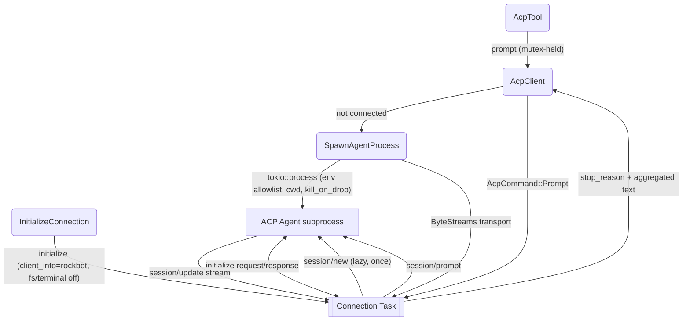

# ACP Delegate — Connection Lifecycle

## 1. Purpose

Deep dive into how a single long-lived connection to a spawned ACP agent is
initialized and reused. References: [ACP Delegate — Happy Flow](../main-path.md).

## 2. Diagram

One long-lived connection task per spawned agent. `AcpClient` talks to it over
a command channel; a single session is created lazily and reused. Prompts are
serialized by a mutex (ACP sessions process one prompt turn at a time).

