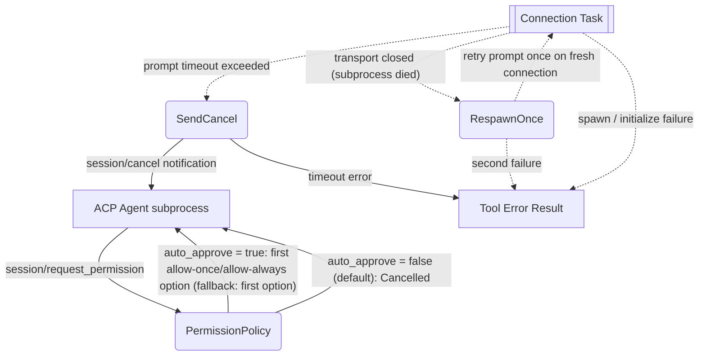

# ACP Delegate — Error Handling, Timeout & Permission Policy

## 1. Purpose

Deep dive into prompt timeouts, subprocess death, spawn failures, and the
permission policy. References: [ACP Delegate — Happy Flow](../main-path.md).

## 2. Diagram

Note: when the agent advertises `authMethods` in `initialize`, RockBot logs a
warning and continues unauthenticated — no credential flow exists yet. Agents
that require auth surface a protocol error, which becomes a tool error result.

Note: on timeout the prompt response is discarded even if the agent later
answers; the turn is considered `cancelled`.
