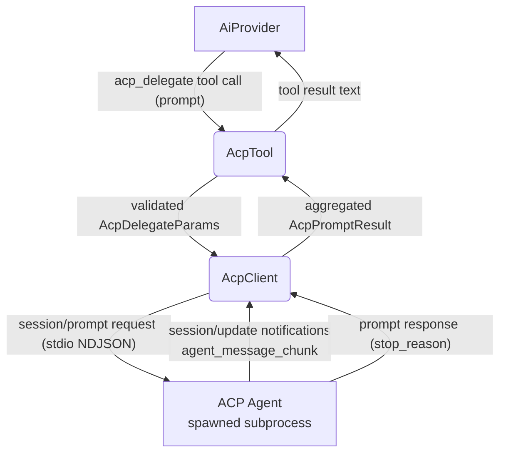

# ACP Delegate — Happy Flow (Main Success Path)

## 1. Purpose

Delegates a natural-language task to an external ACP (Agent Client Protocol)
agent — e.g. `opencode acp`, `codex-acp` — spawned by RockBot as a subprocess
over stdio (NDJSON JSON-RPC 2.0), and returns the agent's aggregated text
output as a tool result to the LLM.

- Upstream: [Configuration Management](../../infra/config/main-path.md) provides `AcpConfig`
  (`[acp]` section; disabled by default)
- Upstream: [Agent Harness](../../agent/agent-harness/tool-dispatch.md) invokes `acp_delegate`
  as a tool during the agent loop
- Downstream: [AI Provider](../../ai/ai-provider/main-path.md) consumes the returned agent
  output for chat completions

Wire types come from the official Rust SDK (`agent-client-protocol` v2,
`agent_client_protocol::schema::v1`). All SDK usage is encapsulated in
`acp.rs` (`AcpClient`); `tools/acp.rs` (`AcpTool`) only validates params and
forwards the prompt string.

## 2. Diagram

## 3. Data Structures

Shared data structures for these flows are documented in
[`structures.md`](structures.md) — see its `## 1. Overview` for
the subsystem context.
