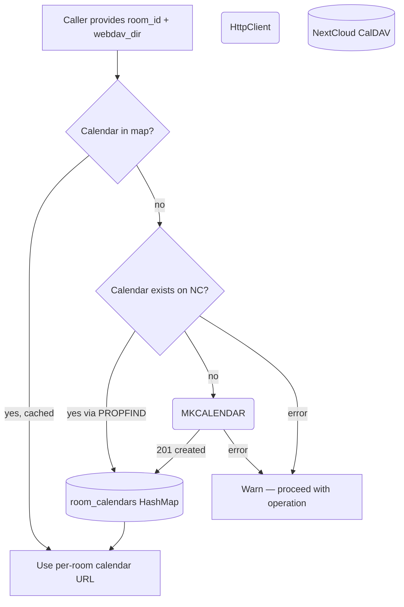

# WebDAV Calendar — Auto Creation

## 1. Purpose

The per-room calendar is auto-created on first use via CalDAV `MKCALENDAR`,
keyed by `room_id → webdav_dir` in the in-memory `room_calendars` map. The
ensure step is fast-pathed when the calendar is already cached; otherwise it
checks existence on NextCloud and creates it if missing.

- Downstream: [Agent Harness](../../agent/agent-harness/agent-loop.md) injects `room_id` + `webdav_dir`
  into calendar tool arguments

## 2. Diagram

