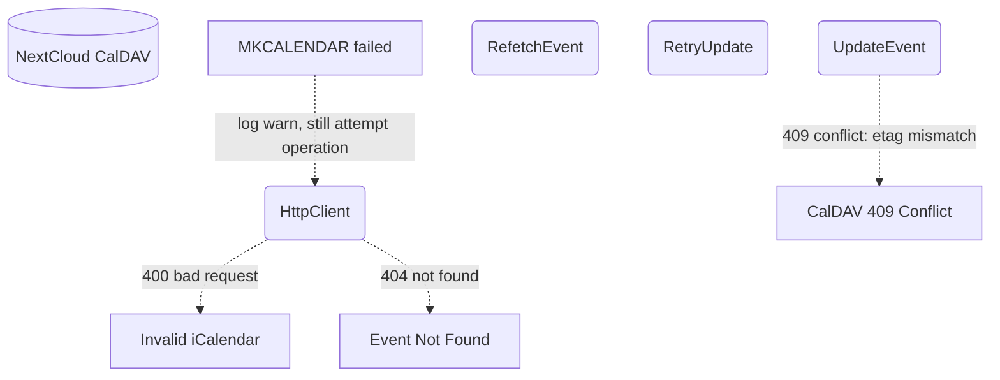

# WebDAV Calendar — Error Handling

## 1. Purpose

Error paths and fallbacks for calendar operations; see [Main Path](../main-path.md) for the happy flow.

## 2. Diagram

Note: The 409 Conflict retry loop (refetch → merge → retry with new etag) is not yet implemented. Calendar update returns an error on etag mismatch. MKCALENDAR failure (permissions, unsupported) is non-fatal — the operation still proceeds against the target URL.
