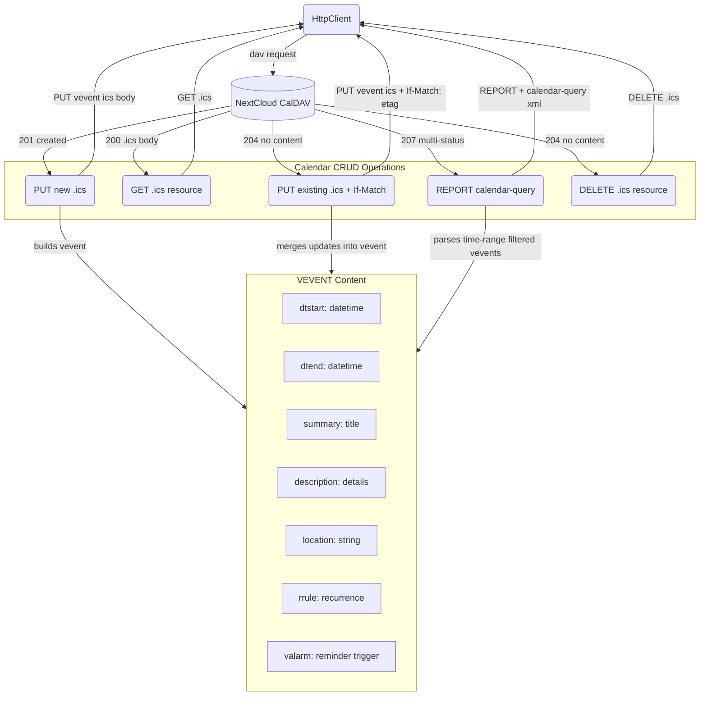

# WebDAV Calendar — Operations Deep Dive

## 1. Purpose

Details of the per-operation request/response shapes and VEVENT content used
in [Main Path](../main-path.md).

Per [NextCloud Calendar user guide](https://docs.nextcloud.com/server/latest/user_manual/en/groupware/calendar.html) and [RFC 4791](https://datatracker.ietf.org/doc/html/rfc4791). Events are iCalendar (RFC 5545) `VEVENT` objects. The CalDAV base URL is `/remote.php/dav/calendars/{username}/{webdav_dir}/` (e.g. `/remote.php/dav/calendars/bot/r-General/`). Each event is a resource named `{uid}.ics` within that collection.

## 2. Diagram

