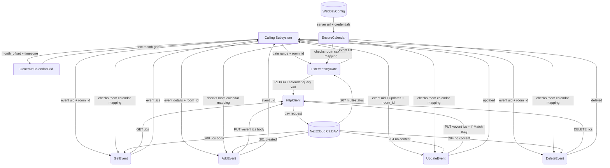

# WebDAV Calendar — Main Path

## 1. Purpose

CalDAV event access wrapping NextCloud's calendar service. Supports listing
events by date range, create/read/update/delete individual events with
iCalendar (RFC 5545) `VEVENT` payloads, `VALARM` reminders, and a
`mini_calendar` action that renders a text-based month calendar grid (no
CalDAV calls — pure computation, replaces the former standalone datetime
tool's calendar view).

**Scope**: Calendar events are **per-room** — each RocketChat room gets its own
NextCloud calendar, auto-created on first use via CalDAV `MKCALENDAR`. The
calendar name is `{webdav_dir}` (matching the WebDAV directory name,
e.g. `r-General`, `d-bob`), stored under the configured user's CalDAV
calendar home (`/remote.php/dav/calendars/{username}/`). Events from
different rooms are fully isolated.

> **Note:** The `timezone` parameter is accepted for forward compatibility
> but the current implementation always computes dates in UTC. The LLM is
> expected to perform any necessary timezone offset arithmetic itself using
> the UTC time injected into the system prompt.

- Upstream: [Configuration Management](../../infra/config/main-path.md) provides `WebDavConfig`
  (server URL, credentials)
- Downstream: [Agent Harness](../../agent/agent-harness/agent-loop.md) injects `room_id` + `webdav_dir`
  into calendar tool arguments. `room_id` is used as the cache key in
  `room_calendars`, while `webdav_dir` names the per-room calendar
  (auto-created on first use)

## 2. Diagram

