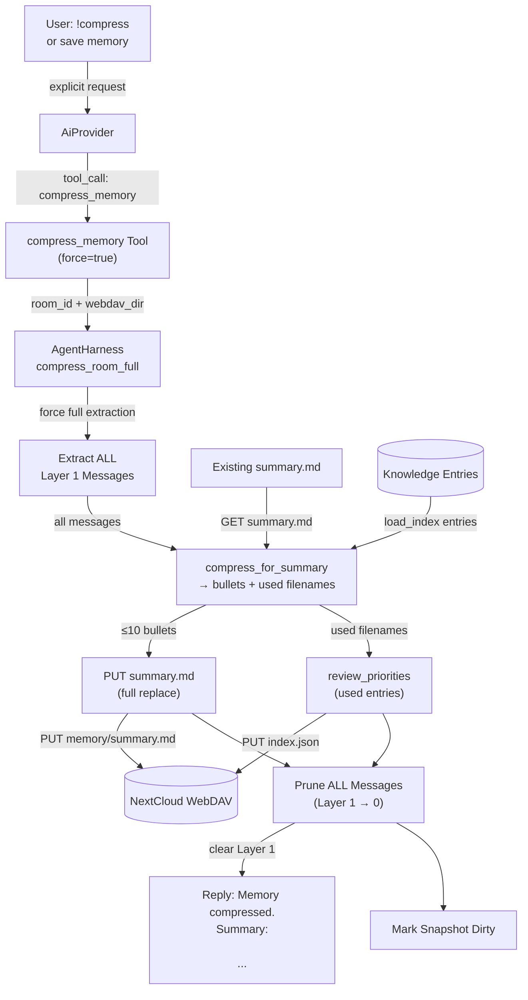
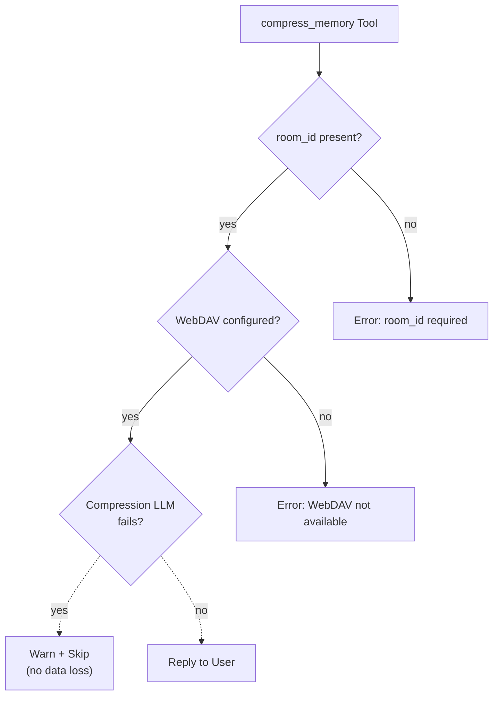

# Compress Memory

## 1. Purpose

User-explicit memory compression tool. When the user says `!compress` or
explicitly asks to save/compress memory, the LLM invokes `compress_memory`.
Unlike background compression (which takes only the oldest half), this tool
compresses **all** Layer 1 messages into a replacement `summary.md` and
clears the conversation history entirely — zero messages remain.

The tool uses the same LLM compression prompt as background compression but
with `force=true`, extracting all messages instead of half. Knowledge priority
is also reviewed: entries used in the conversation are promoted.

- Upstream: [Agent Harness](../agent-harness.md) dispatches the tool call with
  room context (`room_id` + `webdav_dir`) auto-injected
- Upstream: [AI Provider](../base/ai-provider.md) executes the compression
  prompt (one-shot, no tools) and returns token usage
- Upstream: [Memory Management](../base/memory.md) provides Layer 1 messages
  and stores the resulting `summary.md`
- Upstream: [Knowledge Management](../base/knowledge.md) provides the entry
  list for LLM relevance identification
- Downstream: WebDAV crate persists `summary.md`
- Downstream: [Knowledge Priority Algorithm](../base/knowledge-priority.md)
  receives LLM-identified used entry filenames
- Downstream: [Memory Compression](../base/memory-compression.md) — shares the
  same `compress_for_summary` prompt and `write_summary_md` path

## 2. Diagram

### 2a. Happy Flow — Full Compression



The tool is **synchronous** — the user waits for the compression to complete
and receives the summary as confirmation. This is acceptable because the user
explicitly requested it.

### 2b. Tool Parameters

| Parameter | Type | Required | Description |
|-----------|------|----------|-------------|
| `room_id` | `string` | No (auto-injected) | Room UUID |
| `webdav_dir` | `string` | No (auto-injected) | Room WebDAV directory key |

No user-supplied parameters needed — the tool operates on the current room's
memory. Room context is injected by the harness before tool execution.

### 2c. Error Handling



If WebDAV is not configured, the tool returns an error. If the compression LLM
fails, the tool reports the error to the user — messages remain in Layer 1
unchanged (no data loss).

## 3. Data Structures

### Tool Arguments (JSON)

```json
{
    "webdav_dir": "r-general",
    "room_id": "abc123-room-uuid"
}
```

### Tool Result

On success, returns a confirmation string with the compressed summary:

```
Memory compressed. Summary:

# Memory Summary

- User prefers short answers
- Project X uses Rust
- Database in 1Password
```

## 4. Integration

| Subsystem | Method | Purpose |
|-----------|--------|---------|
| `AgentHarness` | `compress_room_full(room_id)` | Full compression + clear |
| `MemoryManager` | `check_and_archive(room_id, true)` | Extract all messages |
| `MemoryManager` | `prune_archived(room_id, count)` | Clear Layer 1 |
| `MemoryManager` | `set_summary(room_id, Some(...))` | Cache new summary |
| `KnowledgeManager` | `load_index(webdav, wd)` | Get entry list for LLM |
| `KnowledgeManager` | `review_priorities(webdav, wd, used)` | Promote/decay entries |
| WebDAV | `write_file_with_fallback(path, bytes)` | Persist summary.md |

The tool is registered in `ToolRegistry` at startup when WebDAV is configured.
It is a **stub tool** — its `execute()` is never called in the main code path.
Instead, `AgentHarness::process_message()` intercepts the `compress_memory`
tool call and invokes `compress_room_full()` directly on `&mut self` (the harness
lock is already held by the caller). The tool exists solely for LLM
tool-registration (name, description, parameters) and argument injection. This
avoids a deadlock: the tool would otherwise attempt to re-acquire the same
`Arc<Mutex<AgentHarness>>` lock that `process_message` already holds.

## 5. Registration

```rust
// main.rs — stub tool, no harness ref needed (intercepted in process_message)
let mut h = harness.lock().await;
h.register_tool(Box::new(CompressMemoryTool::new()));
```

Room context (`room_id` + `webdav_dir`) is auto-injected by the harness before
tool execution via `inject_room_context()`. The tool name is added to the
stateful-tools list alongside `webdav`, `edit_soul`, `save_knowledge`, etc.

### Execution path

When the LLM returns a `compress_memory` tool call, `process_message()` does
**not** call `execute_by_name()` for this tool. Instead it directly invokes
`self.compress_room_full(room_id)` on the harness, which already holds the
exclusive `&mut` reference. This is safe because the harness lock is held by
the caller (`main.rs`) for the duration of `process_message()`. The tool's
own `execute()` returns an error if called directly.
