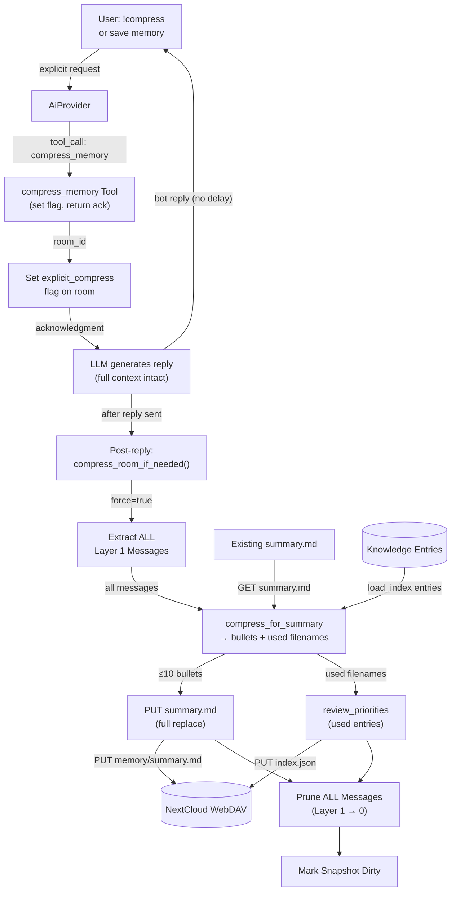
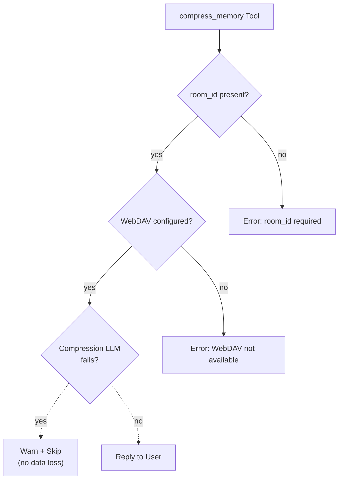

# Compress Memory

## 1. Purpose

User-explicit memory compression tool. When the user says `!compress` or
explicitly asks to save/compress memory, the LLM invokes `compress_memory`.
Unlike background compression (which takes only the oldest half), this tool
compresses **all** Layer 1 messages into a replacement `summary.md` and
clears the conversation history entirely — zero messages remain.

The tool uses the same LLM compression prompt as background compression but
with `force=true`, extracting all messages instead of half. Knowledge priority
is also reviewed: entries used in the conversation are promoted.

- Upstream: [Agent Harness](../agent-harness.md) dispatches the tool call with
  room context (`room_id` + `webdav_dir`) auto-injected
- Upstream: [AI Provider](../base/ai-provider.md) executes the compression
  prompt (one-shot, no tools) and returns token usage
- Upstream: [Memory Management](../base/memory.md) provides Layer 1 messages
  and stores the resulting `summary.md`
- Upstream: [Knowledge Management](../base/knowledge.md) provides the entry
  list for LLM relevance identification
- Downstream: WebDAV crate persists `summary.md`
- Downstream: [Knowledge Priority Algorithm](../base/knowledge-priority.md)
  receives LLM-identified used entry filenames
- Downstream: [Memory Compression](../base/memory-compression.md) — shares the
  same `compress_for_summary` prompt and `write_summary_md` path

## 2. Diagram

### 2a. Happy Flow — Flag-Driven (Post-Reply)

Compression is **post-reply, flag-driven**. The tool call sets
`explicit_compress` flag; the LLM generates a natural reply using the
full conversation context; then `compress_room_if_needed()` executes the
actual compression after the reply is sent. This avoids clearing history
mid-conversation (which would make the LLM see an empty context).



The user receives the bot's reply immediately (no delay for compression).
Compression runs asynchronously after the reply is delivered to RocketChat.

### 2b. Tool Parameters

| Parameter | Type | Required | Description |
|-----------|------|----------|-------------|
| `room_id` | `string` | No (auto-injected) | Room UUID |
| `webdav_dir` | `string` | No (auto-injected) | Room WebDAV directory key |

No user-supplied parameters needed — the tool operates on the current room's
memory. Room context is injected by the harness before tool execution.

### 2c. Error Handling



If WebDAV is not configured, the tool returns an error. If the compression LLM
fails, the tool reports the error to the user — messages remain in Layer 1
unchanged (no data loss).

## 3. Data Structures

### Tool Arguments (JSON)

```json
{
    "webdav_dir": "r-general",
    "room_id": "abc123-room-uuid"
}
```

### Tool Result

On success, returns a confirmation string with the compressed summary:

```
Memory compressed. Summary:

# Memory Summary

- User prefers short answers
- Project X uses Rust
- Database in 1Password
```

## 4. Integration

### Flag-driven execution

The tool call sets `explicit_compress` flag on the room. Actual compression
is handled by `compress_room_if_needed()` which is called **after** the reply
is sent (in `main.rs`). When the flag is set, `compress_room_inner` uses
`force=true` for full compression.

| Phase | Subsystem | Method | Purpose |
|-------|-----------|--------|---------|
| Tool call | `process_message` | `memory.set_explicit_compress(room_id)` | Set flag, return ack |
| Post-reply | `main.rs` | `compress_room_if_needed(room_id)` | Checks flag, triggers compression |
| Post-reply | `MemoryManager` | `needs_compression(room_id)` | Includes `explicit_compress` |
| Post-reply | `MemoryManager` | `check_and_archive(room_id, true)` | Extract all messages |
| Post-reply | `MemoryManager` | `prune_archived(room_id, count)` | Clear Layer 1 |
| Post-reply | `MemoryManager` | `set_summary(room_id, Some(...))` | Cache new summary |
| Post-reply | `MemoryManager` | `clear_pressure_flags(room_id)` | Clears all flags incl. explicit |
| Post-reply | `KnowledgeManager` | `load_index(webdav, wd)` | Get entry list for LLM |
| Post-reply | `KnowledgeManager` | `review_priorities(webdav, wd, used)` | Promote/decay entries |
| Post-reply | WebDAV | `write_file_with_fallback(path, bytes)` | Persist summary.md |

The tool is registered in `ToolRegistry` at startup when WebDAV is configured.
It is a **stub tool** — its `execute()` is never called in the main code path.
Instead, `AgentHarness::process_message()` intercepts the `compress_memory`
tool call and invokes `compress_room_full()` directly on `&mut self` (the harness
lock is already held by the caller). The tool exists solely for LLM
tool-registration (name, description, parameters) and argument injection. This
avoids a deadlock: the tool would otherwise attempt to re-acquire the same
`Arc<Mutex<AgentHarness>>` lock that `process_message` already holds.

## 5. Registration

```rust
// main.rs — stub tool, no harness ref needed (intercepted in process_message)
let mut h = harness.lock().await;
h.register_tool(Box::new(CompressMemoryTool::new()));
```

Room context (`room_id` + `webdav_dir`) is auto-injected by the harness before
tool execution via `inject_room_context()`. The tool name is added to the
stateful-tools list alongside `webdav`, `edit_soul`, `save_knowledge`, etc.

### Execution path

When the LLM returns a `compress_memory` tool call, `process_message()` does
**not** call `execute_by_name()` for this tool. Instead it sets
`explicit_compress` flag on the room and returns a lightweight acknowledgment
as the tool result. The LLM then generates a natural reply using the full
context. After the reply is delivered (in `main.rs`), `compress_room_if_needed()`
detects the flag and runs full compression (`force=true`).

The tool's own `execute()` is never reached in production — it exists solely
for LLM registration. Calling it directly returns an error.
