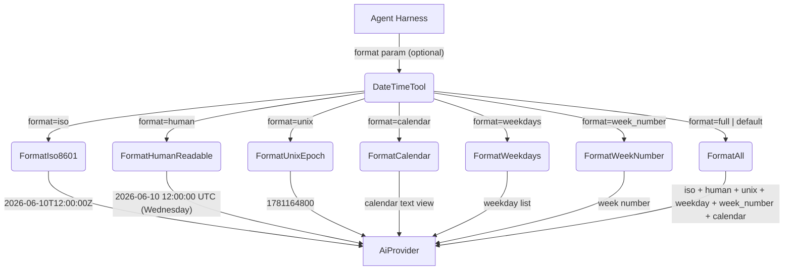
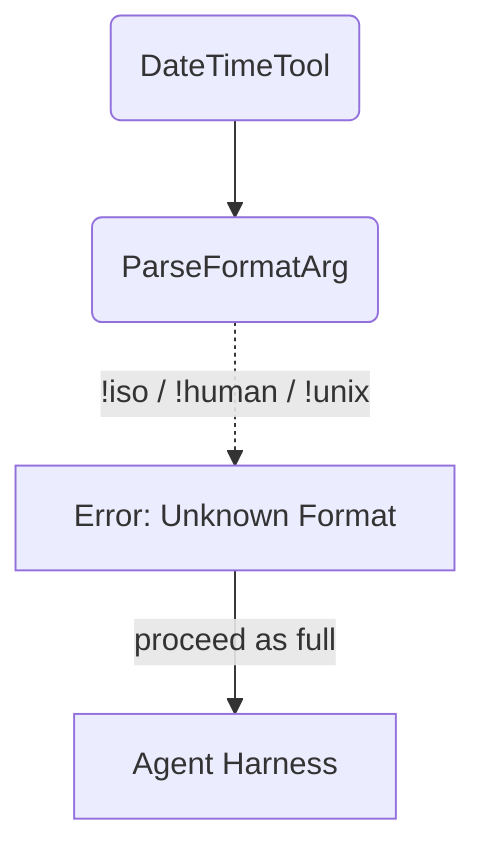

# DateTime

## 1. Purpose

Returns the current UTC date and time in multiple formats — ISO 8601,
human-readable with weekday, Unix epoch seconds, weekday enumeration,
week calendar view, week number, or all combined. A pure computation
tool with no external dependencies. Supports calendar-style date queries
like "what day of the week is next Friday?" and week-number lookups.

- Upstream: [Agent Harness](../agent-harness.md) invokes `DateTimeTool` with an
  optional format selector and query parameters

## 2. Diagram

### 2a. Happy Flow (Main Success Path)



### 2b. Error Handling



Invalid format strings fall back to `full` output — no hard error.

## 3. Data Structures

#### `DateTimeParams`

| Field      | Type     | Notes                                                      |
| ---------- | -------- | ---------------------------------------------------------- |
| `format`   | `string` | `"iso"`, `"human"`, `"unix"`, `"calendar"`, `"weekdays"`, `"week_number"`, or `"full"` (default) |
| `week_offset` | `int` | Week offset for calendar/weekdays: 0=current, 1=next, -1=previous. Default: 0 |

#### Date Computation

All formats are derived from `SystemTime::now()` via a civil date algorithm
(Howard Hinnant's `days_from_civil` / `civil_from_days`). No external time
library is used — the implementation is self-contained.

| Format        | Example output                                                                 |
| ------------- | ------------------------------------------------------------------------------ |
| `iso`         | `2026-06-10T12:00:00Z`                                                         |
| `human`       | `2026-06-10 12:00:00 UTC (Wednesday)`                                          |
| `unix`        | `1781164800`                                                                   |
| `week_number` | `24` (ISO 8601 week number)                                                    |
| `weekdays`    | `Monday: 2026-06-08, Tuesday: 2026-06-09, ..., Sunday: 2026-06-14`             |
| `calendar`    | 7-row calendar view with current date marked                                   |
| `full`        | All fields above combined (iso, human, unix, weekday, week_number, calendar)   |

The `calendar` format outputs a text grid:

```
June 2026
Mon  Tue  Wed  Thu  Fri  Sat  Sun
  1    2    3    4    5    6    7
  8    9   10*  11   12   13   14
 15   16   17   18   19   20   21
 22   23   24   25   26   27   28
 29   30
```
