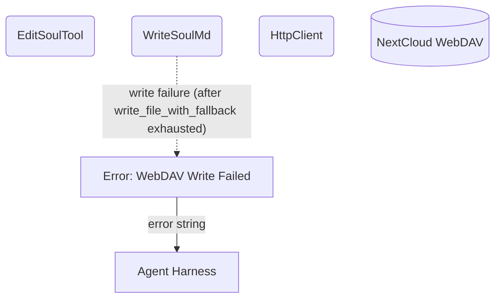

# Error Handling & Fallbacks

## 1. Purpose

On write failure, the tool relies on the underlying `write_file_with_fallback`
(AutoMkcol → mkcol parents → retry PUT). The tool does not implement its own
retry loop — errors bubble up directly via `?`. See the [happy path](../main-path.md).

## 2. Diagram

