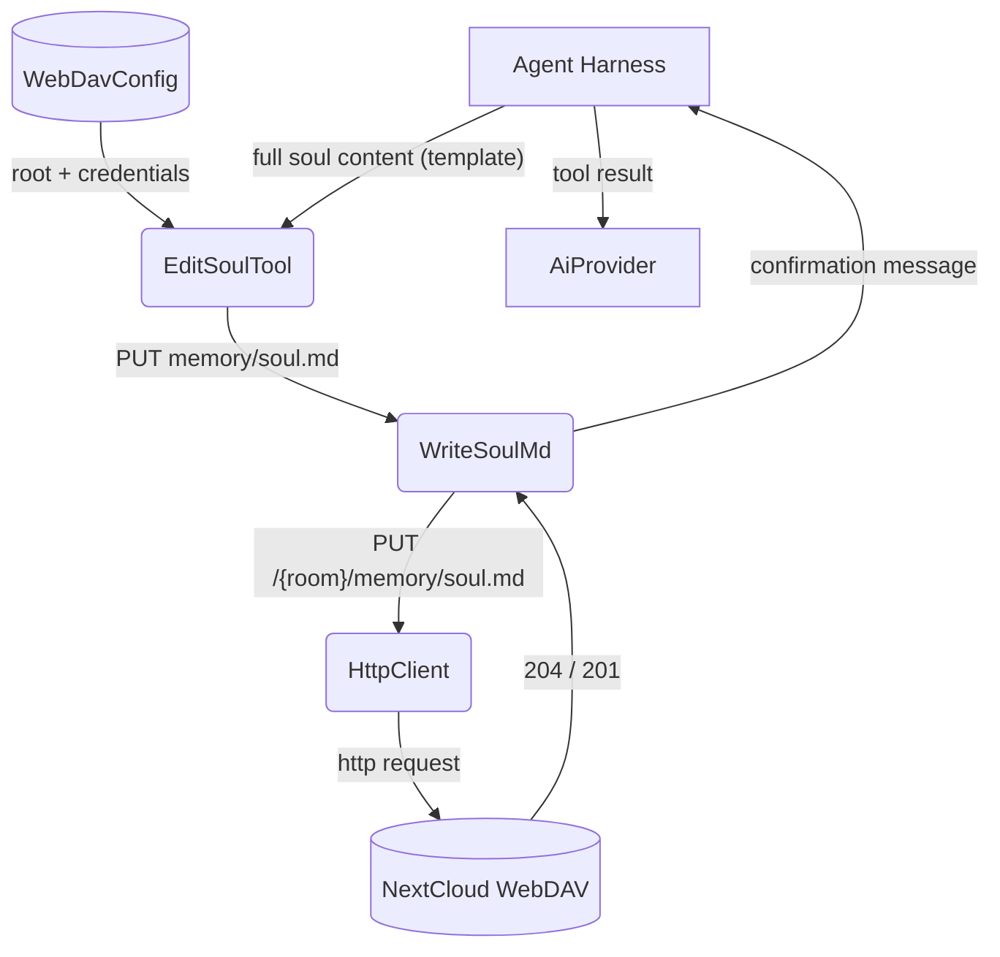

# Happy Flow (Main Success Path)

## 1. Purpose

Manages the bot's permanent per-room "soul" memory — a single `soul.md` file
stored on WebDAV under `{room}/memory/soul.md`. The tool performs a **full
replace** of the entire file content using the standard soul template.

The LLM MUST use this exact template when calling edit_soul:

```markdown
# Soul Memory

- My name is YourName ✨
- (optional preference)
- (optional fact)
- (optional preference)
- (optional fact)
```

The soul is a **flat enumeration list** — each line is a `-` bullet item. The
**first item always** starts with `My name is ...`. The display name is
extracted by regex `My name is (.+)` from that first item. Keep it under 32
characters. Additional items follow the same flat list format with no
sub-headings.

- Upstream: [Configuration Management](../../infra/config/main-path.md) provides WebDAV
  credentials for file access
- Upstream: [Agent Harness](../../agent/agent-harness/agent-loop.md) invokes `EditSoulTool` with
  the full soul content
- Downstream: [WebDAV Tool](../webdav/main-path.md) performs the PUT operation
- Downstream: [Memory Management](../../memory/memory/soul-editing.md) — soul.md lives alongside
  other per-room memory archives under `{room}/memory/`

## 2. Diagram


