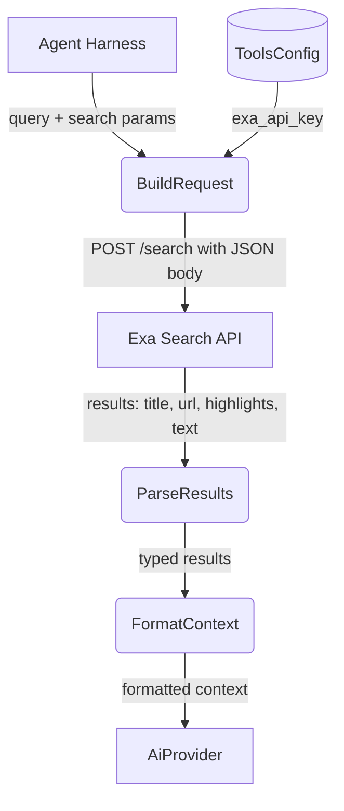
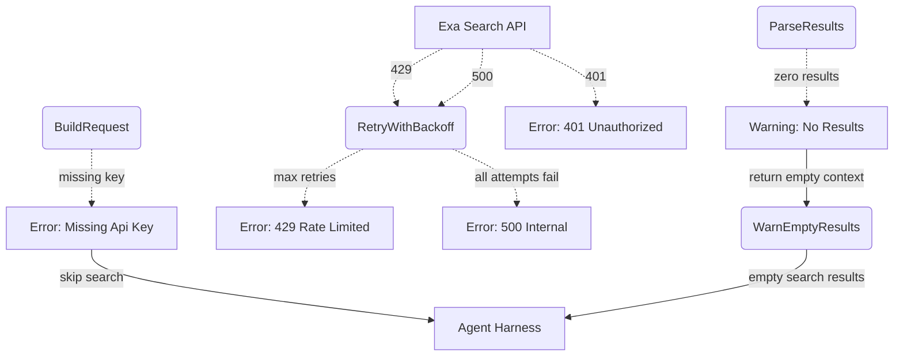
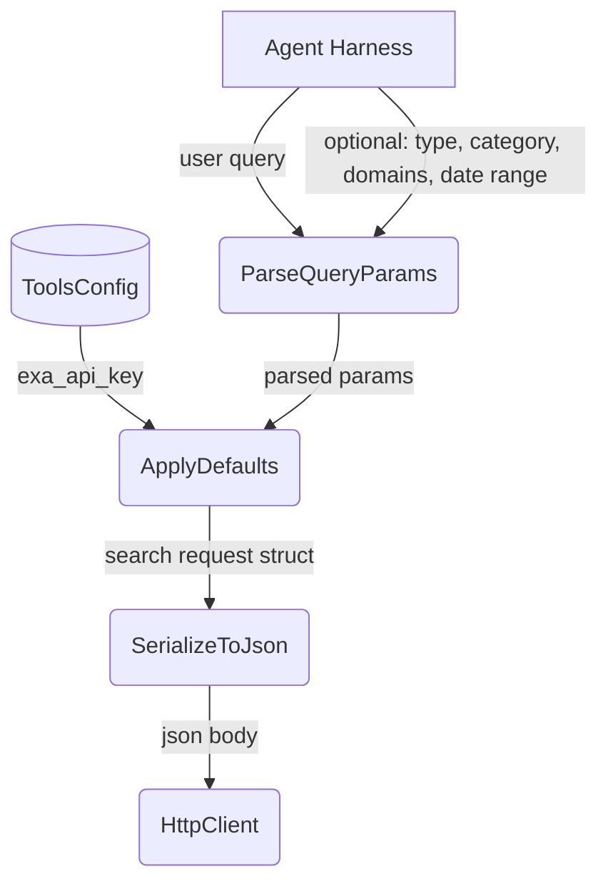
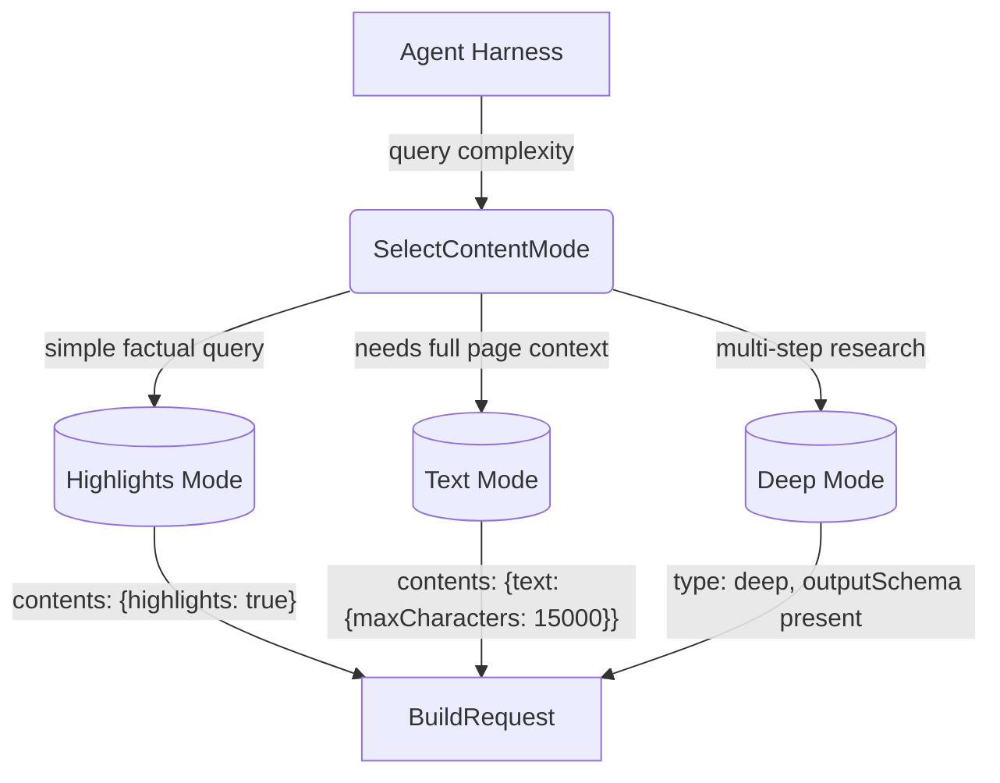

# Exa Web Search

## 1. Purpose

Performs internet searches via the Exa API (`POST https://api.exa.ai/search`),
returning token-efficient highlights or full page text from search results.
Supports domain filtering, date ranges, content categories (company, people,
research papers, news), and deep research modes with structured output.

- Upstream: [Configuration Management](../base/config.md) provides `ToolsConfig`
  containing `exa_api_key`
- Upstream: [Agent Harness](../agent-harness.md) invokes search as a tool during
  the agent loop, passing a natural-language query
- Downstream: [AI Provider](../base/ai-provider.md) consumes returned `highlights`
  and `text` as context for chat completions

## 2. Diagram

### 2a. Happy Flow (Main Success Path)

### 2b. Error Handling & Fallbacks

Note: HTTP errors are retried with up to 3 attempts using exponential backoff before returning a failure.

Note: 401 errors return a specific message: `"Exa search failed: invalid API key (401). Check your EXA_API_KEY env var or [tools.exa] config."`

### 2c. Search Request Construction Deep Dive

Search parameters defaulted by `ApplyDefaults`:

| Parameter      | Default                            |
| -------------- | ---------------------------------- |
| `type`         | `"auto"`                           |
| `numResults`   | `5`                                |
| `contents`     | `{"highlights": true}`             |

Agent callers may override `type` (e.g. `"deep"` for research), `category`
(e.g. `"news"` for current events), `startPublishedDate`/`endPublishedDate` for
date bounding, or `includeDomains`/`excludeDomains` for source filtering.

### 2d. Content Mode Selection

`highlights` mode is the default for agent workflows — it returns 10x fewer
tokens than full text while preserving relevant excerpts. `text` mode is used
when the caller needs comprehensive page content for analysis. `deep` mode
enables multi-step reasoning with structured outputs via `outputSchema`.

## 3. Data Structures

### `SearchRequest`

| Field                | Type                    | Notes                                             |
| -------------------- | ----------------------- | ------------------------------------------------- |
| `query`              | `NonEmptyString`        | Natural-language search query. Validated at LLM boundary (empty query fails at parse boundary). |
| `type`               | `String`                | `auto` (default), `fast`, `deep` |
| `num_results`        | `u32`                   | Results to return (1-20, default 5)              |
| `category`           | `Option<String>`        | `company`, `people`, `research paper`, `news`, `personal site`, `financial report` |
| `include_domains`    | `Option<Vec<String>>`   | Restrict to these domains (max 1200)              |
| `exclude_domains`    | `Option<Vec<String>>`   | Exclude these domains (max 1200)                  |
| `start_published_date` | `Option<String>`      | ISO 8601; only results published after this date  |
| `end_published_date` | `Option<String>`        | ISO 8601; only results published before this date |
| `user_location`      | `Option<String>`        | Two-letter ISO country code (e.g. `"US"`)         |
| `contents`           | `ContentsOptions`       | Content extraction configuration                  |
| `system_prompt`      | `Option<String>`        | Instructions for synthesized output / search planning |
| `output_schema`      | `Option<JsonSchema>`    | JSON schema for structured output (all search types) |

### `ContentsOptions`

| Field             | Type                             | Notes                                                |
| ----------------- | -------------------------------- | ---------------------------------------------------- |
| `highlights`      | `Option<HighlightsOptions>`      | Key excerpts relevant to query (recommended for agents) |
| `text`            | `Option<TextOptions>`            | Full page text as markdown                           |
| `summary`         | `Option<SummaryOptions>`         | LLM-generated summary                                |
| `max_age_hours`   | `Option<i32>`                    | `0` = always livecrawl, `-1` = cache only, omit for default |
| `subpages`        | `u32`                            | Number of subpages to crawl per result               |
| `subpage_target`  | `Option<Vec<String>>`            | Keywords to prioritize for subpage selection         |
| `extras`          | `Option<ExtrasOptions>`          | Links and image extraction                           |

### `HighlightsOptions`

| Field            | Type              | Notes                                                |
| ---------------- | ----------------- | ---------------------------------------------------- |
| `enabled`        | `bool`            | Set to `true` for highest-quality default excerpts   |
| `query`          | `Option<String>`  | Custom query guiding which highlights are selected   |
| `max_characters` | `Option<u32>`     | Cap on highlight characters per URL (max 15000)      |

### `TextOptions`

| Field               | Type              | Notes                                     |
| ------------------- | ----------------- | ----------------------------------------- |
| `enabled`           | `bool`            | Return full page text                     |
| `max_characters`    | `Option<u32>`     | Character limit (max 10000)              |
| `include_html_tags` | `bool`            | Preserve light HTML structure             |
| `verbosity`         | `Option<String>`  | `compact` (default), `standard`, `full`   |

### `SearchResult`

| Field            | Type                  | Notes                                       |
| ---------------- | --------------------- | ------------------------------------------- |
| `title`          | `String`              | Page title                                  |
| `url`            | `String`              | Page URL                                    |
| `id`             | `String`              | Document ID (same as URL; omitted from formatted output) |
| `published_date` | `Option<String>`      | Estimated publication date (YYYY-MM-DD)     |
| `author`         | `Option<String>`      | Author if available (omitted from formatted output) |
| `highlights`     | `Vec<String>`         | Key excerpts (if requested)                 |
| `highlight_scores` | `Vec<f64>`          | Cosine similarity score per highlight (omitted from formatted output) |
| `text`           | `Option<String>`      | Full page markdown text (if requested)      |
| `summary`        | `Option<String>`      | LLM-generated summary (if requested)        |

> **Implementation note:** None of the data structures below exist as Rust structs
> — all request/response processing uses ad-hoc `serde_json::Value`. The following
> SearchRequest fields are documented but not yet wired to the tool's LLM-facing
> parameter schema: `category`, `include_domains`, `exclude_domains`,
> `start_published_date`, `end_published_date`, `user_location`, `output_schema`.
> The tool currently exposes only `query`, `type`, `contents_mode`, and
> `num_results` to the LLM.

### `SearchResponse`

| Field            | Type                   | Notes                                    |
| ----------------- | ---------------------- | ---------------------------------------- |
| `request_id`     | `String`               | Unique request identifier               |
| `search_type`    | `String`               | Resolved search type (for `auto` queries) |
| `results`        | `Vec<SearchResult>`    | List of search results                   |
| `output`         | `Option<SynthesisOutput>` | Synthesized output (if `outputSchema` present) |
| `cost_dollars`   | `CostSummary`          | Total dollar cost for the request        |

### `SynthesisOutput`

| Field       | Type                   | Notes                                         |
| ----------- | ---------------------- | --------------------------------------------- |
| `content`   | `serde_json::Value`    | String or object matching `outputSchema`      |
| `grounding` | `Vec<GroundingEntry>`  | Field-level citations with confidence labels  |

### `GroundingEntry`

| Field        | Type            | Notes                                      |
| ------------ | --------------- | ------------------------------------------ |
| `field`      | `String`        | Path in `output.content` (e.g. `"content"`, `"companies[0].ceo"`) |
| `citations`  | `Vec<Citation>` | Source URLs and titles                     |
| `confidence` | `String`        | `"low"`, `"medium"`, or `"high"`           |

### `Citation`

| Field   | Type     | Notes        |
| ------- | -------- | ------------ |
| `url`   | `String` | Source URL   |
| `title` | `String` | Source title |

## 4. Exa API Reference

### Endpoints

| Operation       | HTTP Method | Endpoint                     | Notes                                |
| --------------- | ----------- | ---------------------------- | ------------------------------------ |
| Search          | `POST`      | `https://api.exa.ai/search`  | Natural-language web search with content extraction |
| Get Contents    | `POST`      | `https://api.exa.ai/contents`| Extract content from known URLs (not used in primary tool path) |

### Authentication

All requests to `POST /search` require the `x-api-key` header. Obtain an API
key from the [Exa Dashboard](https://dashboard.exa.ai/api-keys).

### Search Types

| Type              | Latency       | Use Case                                          |
| ----------------- | ------------- | ------------------------------------------------- |
| `auto`            | ~1 second     | Default; balances speed and quality               |
| `fast`            | ~450 ms       | Reduced latency with minimal quality sacrifice    |
| `deep`            | 4-15 seconds  | Multi-step reasoning with structured outputs      |

### Category Filters

| Category           | Best For                                    | Restrictions                                |
| ------------------ | ------------------------------------------- | ------------------------------------------- |
| `company`          | Company pages, LinkedIn profiles            | No `startPublishedDate`, `endPublishedDate`, `excludeDomains` |
| `people`           | Multi-source people data, LinkedIn profiles | Same restrictions as `company`; `includeDomains` limited to LinkedIn |
| `research paper`   | Academic papers, arXiv                      | —                                           |
| `news`             | Current events, journalism                  | —                                           |
| `personal site`    | Blogs, personal pages                       | —                                           |
| `financial report` | SEC filings, earnings reports               | —                                           |

### Error Status Codes

| HTTP Status | Meaning                                                 |
| ----------- | ------------------------------------------------------- |
| 400         | Bad request — invalid parameters or unsupported filter  |
| 401         | Invalid or missing API key                              |
| 422         | Validation error — check parameter types and constraints|
| 429         | Rate limit exceeded                                     |
| 500         | Internal server error                                   |

### Deprecated / Invalid Parameters

The following parameters are commonly misgenerated by LLMs and must not be used:

| Do NOT use                  | Use instead                                      |
| --------------------------- | ------------------------------------------------ |
| `useAutoprompt: true`       | Remove entirely (deprecated)                     |
| `includeUrls` / `excludeUrls` | `includeDomains` / `excludeDomains`            |
| `text: true` (top-level)    | Nest under `contents`: `"contents": {"text": true}` |
| `livecrawl: "always"`       | `contents.maxAgeHours: 0`                        |
| `numSentences`, `highlightsPerUrl`, `tokensNum` | Remove entirely (deprecated or nonexistent) |
