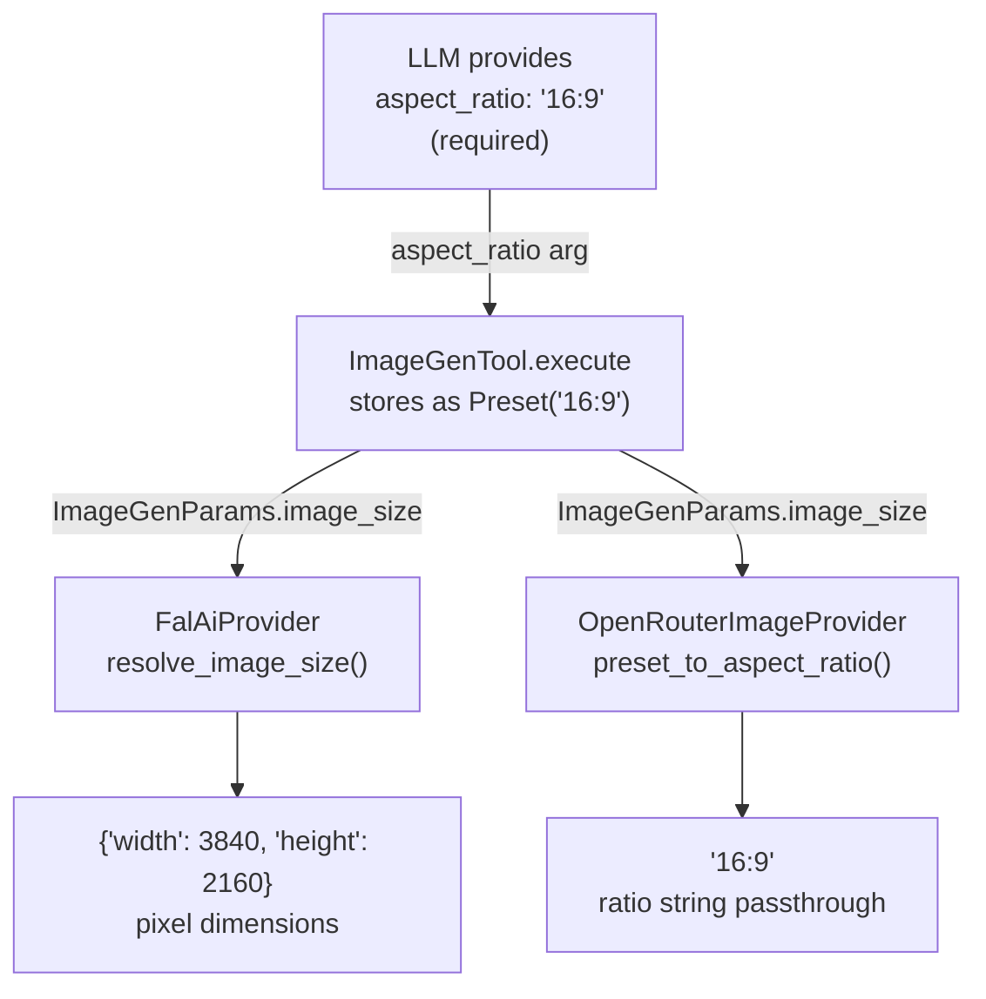

# Aspect Ratio Resolution

## 1. Purpose

Level 2 detail for the happy-path diagram in [main-path](../main-path.md): how the required `aspect_ratio` W:H string supplied by the LLM is stored and resolved to each provider's required format.

## 2. Diagram

The LLM is **required** to supply `aspect_ratio` as a `W:H` string (e.g. `"16:9"`, `"2:3"`,
`"1:1"`). The tool stores the value as `ImageSizeValue::Preset(ratio_string)` and
each provider resolves it to its required format:

| Ratio string | Fal `resolve_image_size()` output | OpenRouter `preset_to_aspect_ratio()` output |
|---|---|---|
| `"16:9"` | `{"width": 3840, "height": 2160}` | `"16:9"` |
| `"9:16"` | `{"width": 2160, "height": 3840}` | `"9:16"` |
| `"2:3"` | `{"width": 2336, "height": 3504}` | `"2:3"` |
| `"1:1"` | `{"width": 2880, "height": 2880}` | `"1:1"` |
| `"4:3"` | `{"width": 3312, "height": 2480}` | `"4:3"` |
| `"3:4"` | `{"width": 2480, "height": 3312}` | `"3:4"` |
| `"3:2"` | `{"width": 3504, "height": 2336}` | `"3:2"` |
| `"auto"` | `"auto"` (passthrough) | `"auto"` (passthrough) |
| `"auto_2K"` | `"auto_2K"` (passthrough) | `"auto_2K"` (passthrough) |
| `"auto_1K"` | `"auto_1K"` (passthrough) | `"auto_1K"` (passthrough) |

Fal requires pixel dimensions in the `image_size` body field; OpenRouter accepts
the ratio string directly in the `image_config.aspect_ratio` field. Unknown
strings (e.g. `"auto"`, `"auto_2K"`, `"auto_1K"`) pass through unchanged to both providers.
Seedream5 (Fal) supports `auto_2K` and `auto_1K` as auto-dimensional mode strings.
