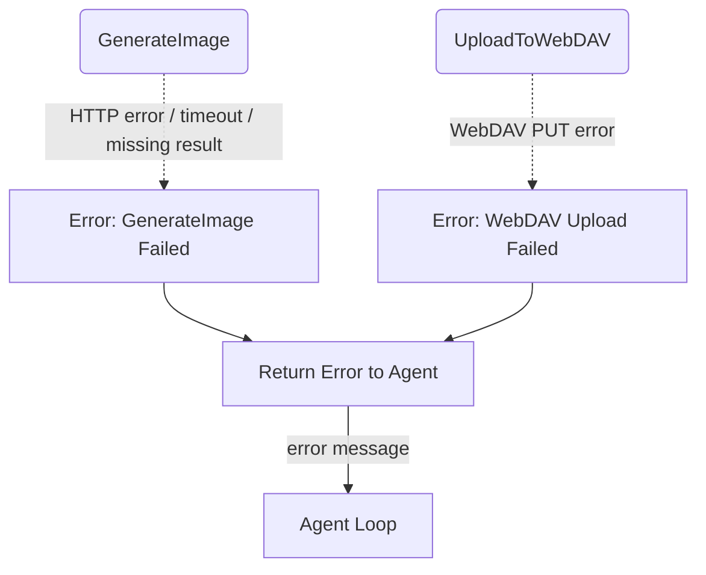

# Error Handling & Fallbacks

## 1. Purpose

Level 2 detail for the happy-path diagram in [main-path](../main-path.md): failure paths when image generation or the WebDAV upload fails, surfacing errors to the agent loop.

## 2. Diagram

