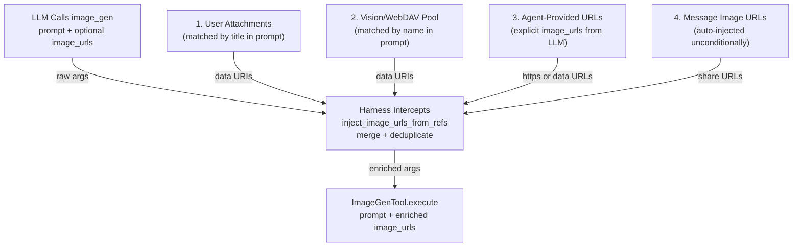

# Image URL Injection for Editing

## 1. Purpose

Level 2 detail for the happy-path diagram in [main-path](../main-path.md): how the harness enriches `image_gen` arguments with image URLs from five converging sources when the LLM makes an editing call.

## 2. Diagram

When the LLM calls `image_gen` for editing (with `image_urls` or
`reference_image_key` in the arguments), the harness intercepts the call at
`inject_image_urls_from_refs()` (`harness.rs:1475`) and enriches the
arguments with image URLs from five converging sources. The full merge logic
is in [Image Interception](../../../interception/image-interception/editing-four-sources.md).

`reference_image_key` provides a simpler alternative: the LLM passes the
`image_key` from a prior `image_gen` result, and the tool looks up the
cached image bytes in `ImageCache`, uploads the data URI to the provider's
CDN, and appends the resulting `https://` URL to `image_urls` — no prompt
matching needed.

After injection, `data:` URIs are uploaded to the provider's CDN (Fal) via
`upload_data_uri`, which returns an `https://` URL. Existing `https://` URLs
(e.g. NextCloud share links from a previous `image_gen` result) pass through
directly. See
[Provider Selection](model-provider-selection.md) for the
subsequent provider dispatch.
