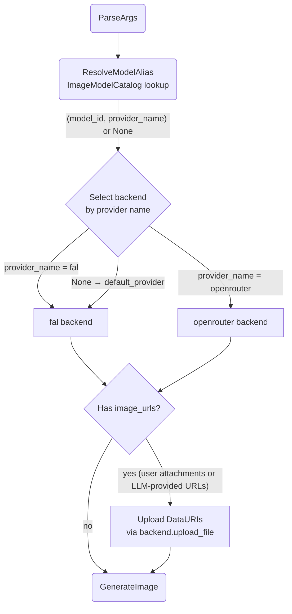

# Model & Provider Selection

## 1. Purpose

Level 2 detail for the happy-path diagram in [main-path](../main-path.md): how the tool resolves the LLM's optional `model` alias against the global image model catalog (spans every supported `[[image_providers]]` entry), routes the call to the corresponding provider backend, and selects the t2i or edit backend based on `image_urls` presence (issue #96).

## 2. Diagram

The catalog is built once at registry time from **every** `[[image_providers]]`
entry backed by a supported provider kind (`fal` / `openrouter`) — entries with
other names are skipped with a warning, and their models are not advertised.
Default model tables are role-scoped: image providers inherit only
image-capable models; chat aliases never enter the image catalog (issue #99).
Each catalog entry is `(alias, model_id, edit_model_id?, provider_name)` — one
alias per model family, with an optional edit companion id for providers that
genuinely use separate edit endpoints (currently only fal; issue #100):

| alias        | t2i id                                  | edit companion                  | provider |
| ------------ | --------------------------------------- | ------------------------------- | -------- |
| `seedream5`  | `bytedance/seedream/v5/pro/text-to-image` | `bytedance/seedream/v5/pro/edit` | fal |
| `gptimage`   | `openai/gpt-image-2`                    | `openai/gpt-image-2/edit`       | fal      |
| `grok`       | `xai/grok-imagine-image/quality/text-to-image` | `xai/grok-imagine-image/quality/edit` | fal |
| others       | single id                                | *(none — same id both modes)*   | fal/openrouter |

A per-call LLM `model` alias resolves to `(model_id, edit_model_id?,
provider_name)`:

- The owning entry's `provider_name` selects the backend from the tool's
  `backends` map.
- The tool picks t2i vs edit by `image_urls` presence and sets
  `params.model_id` to the **mode-appropriate id**: the edit companion when
  editing and one exists, otherwise the plain `model_id`. Unknown explicit
  alias or a backend missing for the resolved provider → `ToolCallParse`
  error naming the valid aliases. No `*_edit` selectable aliases exist
  anymore — mode switching is data-driven from the entry pair.

Omitted `model` ⇒ the `[image_model] default_text_model` alias of the default
provider backend is used (with its edit companion when editing);
`params.model_id = None` only if that alias is unresolvable (config leniency),
in which case the baked backend default applies.

**Provider differences:**

| Aspect | fal.ai | OpenRouter |
|--------|--------|------------|
| `upload_file()` | Initiate + PUT to CDN → file_url | Base64-encode → data URI |
| `generate_image()` | Submit → Poll → Fetch CDN → Download | Catalog-aware routing → single POST → parse base64 response |
| Image delivery | CDN URL → separate HTTP GET | Base64 inline in response JSON |
| Protocol | 3-phase async (submit/poll/fetch) | Single synchronous POST |

fal requires CDN-hosted URLs (data URIs uploaded first), OpenRouter accepts
inline base64. The harness is unaware of this difference — both implement
`ImageProvider::generate_image() -> Vec<u8>`.

OpenRouter routing detail: pure image models (present in the OpenRouter image
catalog) go to the dedicated Image API `POST /images`; models absent from the
catalog fall back to `chat/completions`. See
[AI Provider §2d](../../../ai/ai-provider/level-2/openrouter-image-routing.md).
Because `openai/gpt-image-2` and `xai/grok-imagine-image` model ids are served
through OpenRouter, their aliases under an `openrouter` entry automatically use
that backend — there is no separate openai/xai backend in rockbot.
