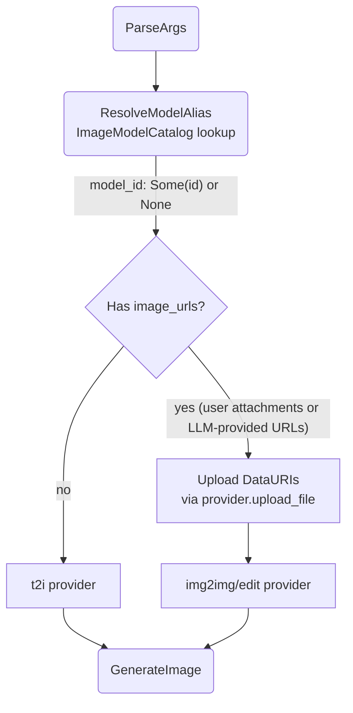

# Model & Provider Selection

## 1. Purpose

Level 2 detail for the happy-path diagram in [main-path](../main-path.md): how the tool resolves the LLM's optional `model` alias against the provider's model catalog, and how it selects the t2i or edit provider based on `image_urls` presence.

## 2. Diagram

The tool selects the model per call: an optional LLM `model` alias is resolved
against the active image provider's `ImageModelCatalog` (alias → model id)
and set as `ImageGenParams.model_id`. Omitted ⇒ the provider instance's own
configured default is used (`params.model_id = None`). Unknown aliases are
rejected at parse with a `ToolCallParse` error naming the valid aliases.

The tool selects the provider based on `image_urls` presence and configuration.
Fal requires CDN-hosted URLs (data URIs uploaded first), OpenRouter accepts
inline base64. The harness is unaware of this difference — both implement
`ImageProvider::generate_image() -> Vec<u8>`.

**Provider differences:**

| Aspect | fal.ai | OpenRouter |
|--------|--------|------------|
| `upload_file()` | Initiate + PUT to CDN → file_url | Base64-encode → data URI |
| `generate_image()` | Submit → Poll → Fetch CDN → Download | Catalog-aware routing → single POST → parse base64 response |
| Image delivery | CDN URL → separate HTTP GET | Base64 inline in response JSON |
| Protocol | 3-phase async (submit/poll/fetch) | Single synchronous POST |

OpenRouter routing detail: pure image models (present only in the image
catalog) go to the dedicated Image API `POST /images`; models absent from the
catalog fall back to `chat/completions`. See
[AI Provider §2d](../../../ai/ai-provider/level-2/openrouter-image-routing.md).

The `ImageProvider` trait abstracts both — the tool and harness never branch on provider type.
