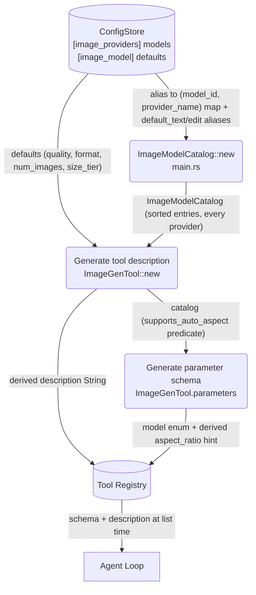

# Tool Description Generation

## 1. Purpose

Level 2 detail for the happy-path diagram in [main-path](../main-path.md): how
the `image_gen` tool's description and parameter schema are **generated from
config at registry time** — the `[image_providers]` `models` map plus
`[image_model]` defaults are the single source of truth (issue #95). Nothing
model-specific is hardcoded: if a model is added, renamed, or removed from
config, the LLM-visible description follows automatically.

## 2. Diagram

## 3. Derived text

| Output           | Derived from                                                    | Drift risk (if hardcoded) |
| ---------------- | --------------------------------------------------------------- | ------------------------- |
| Tool description | alias→(model_id, provider_name) list from **every** provider entry, default t2i/edit aliases, `supports_auto_aspect` | stale model names (e.g. `seedream5`), wrong provider routing hint |
| `model` param description | valid alias list, default t2i/edit aliases | enum/description mismatch |
| `model` param `enum` | `allowed_aliases()` (sorted; omitted when catalog empty) | LLM picks a model id that no longer exists |
| `aspect_ratio` param description | `supports_auto_aspect` (any model id containing `seedream/v5`) | auto-dimensional hint absent/present wrongly |

The `supports_auto_aspect` predicate reuses the same `seedream/v5` model-id
marker as `FalAiProvider` (see [AI Provider](../../../ai/ai-provider/main-path.md) /
`fal.rs` request builder) so the description hint and the provider's body
generation can never disagree about which models accept `auto_1K`/`auto_2K`.
