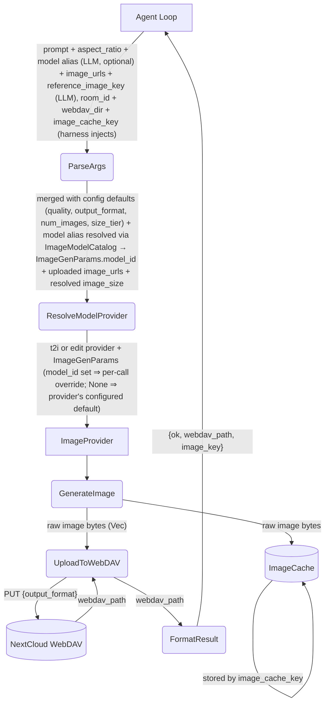

# Image Generation Tool

## 1. Purpose

Generates images via an `ImageProvider` (fal.ai queue API or OpenRouter
Image API / chat-completions fallback), stores them on WebDAV for persistence, and caches the
raw image bytes in the shared `ImageCache`. The agent loop calls `image_gen`
with a prompt and optional parameters; the tool delegates to the provider,
writes to WebDAV, stores to the cache, and returns a minimal result
(`{ok, webdav_path, image_key}`) so the LLM context stays lightweight.

The LLM can select any model from the active image provider's `models`
catalog per call via an optional `model` alias arg; omitting it falls back to
the `[image_model]` defaults (`default_text_model` / `default_edit_model`).
The catalog (alias → model id) is a shared type
(`ImageModelCatalog`) produced from config at startup and consumed by the tool.
The tool's `description()` and `parameters()` schema are generated from the
catalog at registry time (issue #95) — see
[Level 2: Tool Description Generation](level-2/tool-description.md).

- Upstream: [Agent Harness](../../agent/agent-harness/image-interception.md) injects `room_id`, `webdav_dir`,
  and `image_cache_key` (call_id) into tool args before invoking `execute_by_name()`
- Upstream: [Image Injection Pipeline](../../agent/agent-harness/image-sharing.md)
  retrieves the image from ImageCache by key and uploads it as a RocketChat attachment
- Downstream: [Image Provider](../../ai/ai-provider/main-path.md) — `FalAiProvider` (CDN-hosted URLs)
  and `OpenRouterImageProvider` (inline base64) implement `generate_image() -> Vec<u8>`
- Downstream: WebDAV crate persists image assets
- Shared: `ImageCache` (`image_cache.rs`) is the central store keyed by call_id

## 2. Diagram

## 3. Data Structures

Shared with [structures.md](structures.md).
