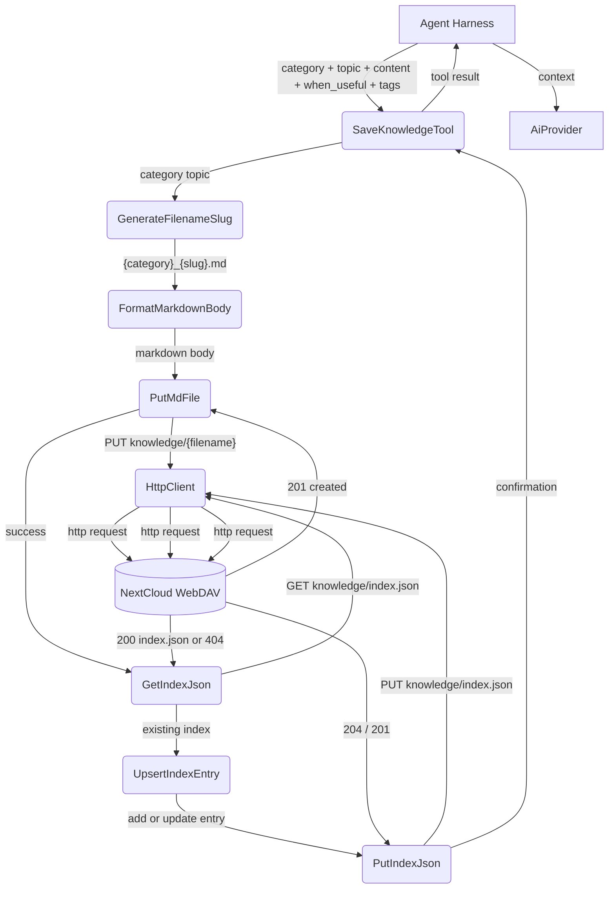
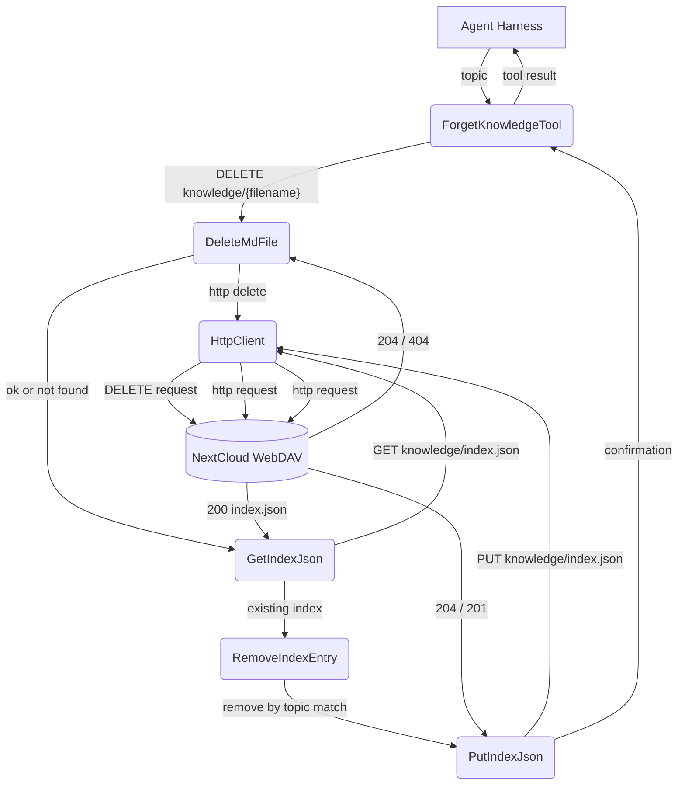
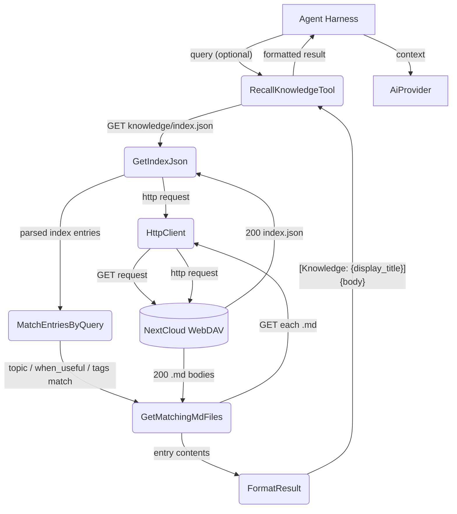
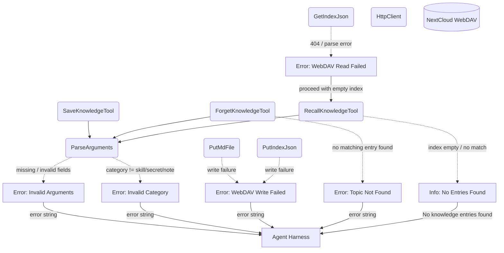
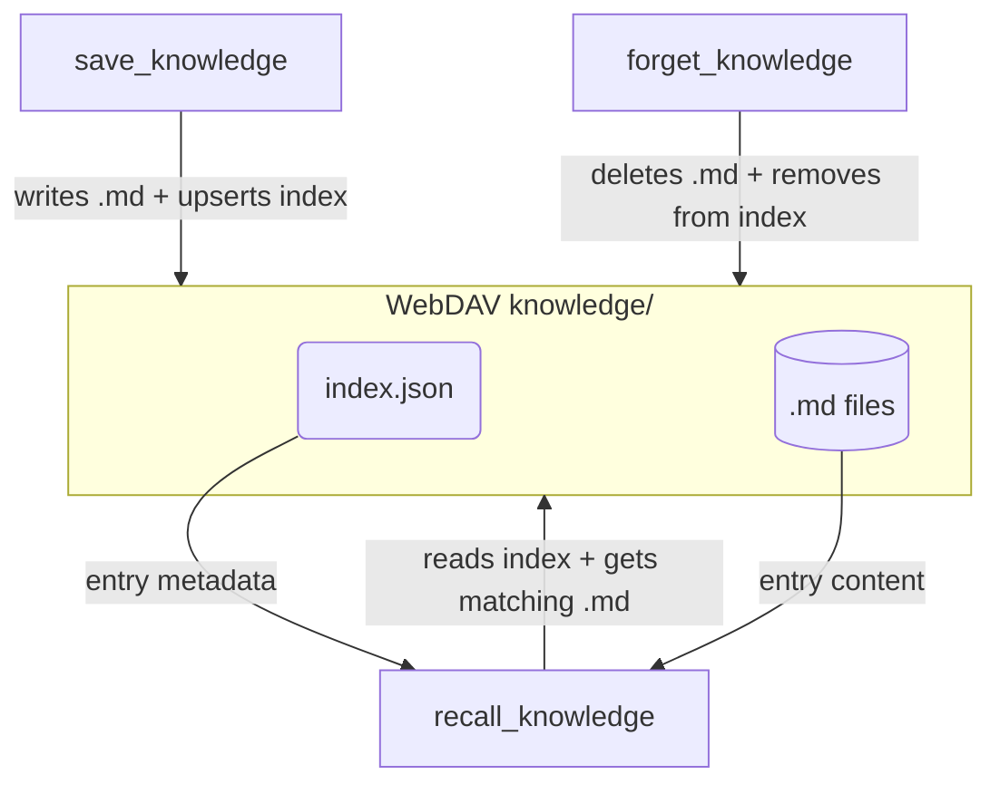

# Knowledge Tools

## 1. Purpose

Three tools for per-room knowledge management on WebDAV — `save_knowledge`
creates `.md` entries with a JSON index, `forget_knowledge` removes entries,
and `recall_knowledge` searches and retrieves stored knowledge. All three
share the same storage backend documented in [Knowledge Management](../knowledge/knowledge.md).

- Upstream: [Configuration Management](../infra/config.md) provides WebDAV
  credentials (knowledge is always enabled when WebDAV is configured)
- Upstream: [Agent Harness](../agent/agent-harness.md) registers and invokes all
  three tools during the agent loop
- Downstream: [Knowledge Management](../knowledge/knowledge.md) defines the
  storage format, index structure, and directory layout
- Downstream: [WebDAV Tool](webdav.md) performs GET/PUT/DELETE operations
  on `knowledge/` directory files

## 2. Diagram

### 2a. Happy Flow — save_knowledge



### 2b. Happy Flow — forget_knowledge



### 2c. Happy Flow — recall_knowledge

When `query` is non-empty, entries are matched by keyword overlap against
`when_useful`, `tags`, and topic. When `query` is empty, all entries in the
index are returned without filtering — the MATCH step is bypassed. Result
format: `[Knowledge: {display_title}]\n{body}`.



### 2d. Error Handling & Fallbacks



### 2e. Tool Interaction Overview



## 3. Data Structures

All data structures are shared with [Knowledge Management](../knowledge/knowledge.md#3-data-structures).

#### SaveKnowledgeParams

| Field        | Type                    | Notes                                           |
| ------------ | ----------------------- | ----------------------------------------------- |
| `category`   | `KnowledgeCategory`     | Enum: `skill`, `secret`, or `note`              |
| `topic`      | `NonEmptyString`        | Short title for the entry. Validated newtype.   |
| `content`    | `NonEmptyString`        | Markdown body of the knowledge entry. Validated newtype. |
| `when_useful`| `NonEmptyString`        | Situation description for retrieval. Validated non-empty (required field). |
| `tags`       | `Option<String>`        | Comma-separated keywords. Serde default: `None`. |
| `priority`   | `KnowledgePriority`     | Enum: `P0`, `P1`, `P2`, `P3`. Required — no default. |
| `webdav_dir` | `Option<String>`        | Room WebDAV key. Serde default: `None` (injected by harness). |

#### ForgetKnowledgeParams

| Field        | Type               | Notes                                    |
| ------------ | ------------------ | ---------------------------------------- |
| `topic`      | `NonEmptyString`   | Title or slug of the entry to delete. Validated newtype. |
| `webdav_dir` | `Option<String>`   | Room WebDAV key. Serde default: `None` (injected by harness). |

#### RecallKnowledgeParams

| Field        | Type               | Notes                                           |
| ------------ | ------------------ | ----------------------------------------------- |
| `query`      | `Option<String>`   | Keyword or topic to search. `None` = return all entries. Serde default: `None`. |
| `webdav_dir` | `Option<String>`   | Room WebDAV key. Serde default: `None` (injected by harness). |

#### File Layout

```
{root}/{webdav_dir}/knowledge/
├── index.json
├── skill_db_api.md
├── secret_github_token.md
├── note_driver_contact.md
└── ...
```
