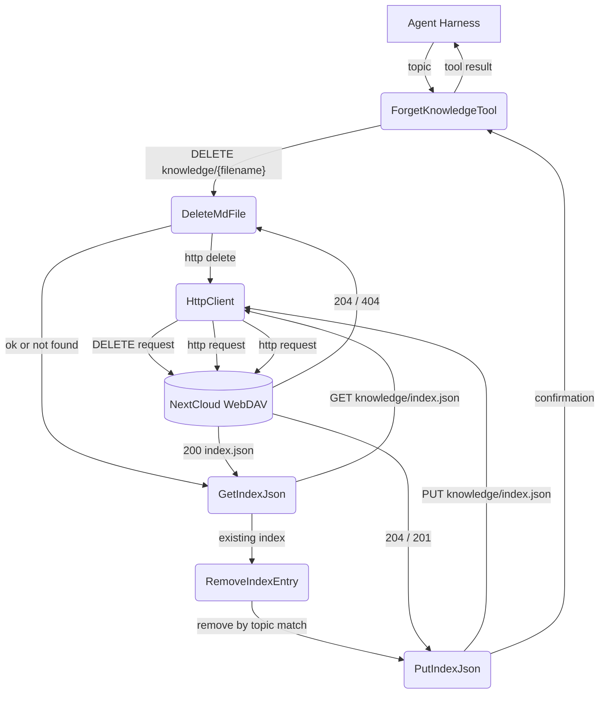

# Happy Flow — forget_knowledge

## 1. Purpose

`forget_knowledge` removes a per-room knowledge entry on WebDAV — it deletes
the entry's `.md` file under `knowledge/` and removes its record from the
`index.json` index, using the storage backend documented in
[Knowledge Management — Write](../../knowledge/knowledge/write.md).

**References:** [Shared Structures](structures.md) — params and file layout.

## 2. Diagram

## 3. Data Structures

Shared data structures for these flows are documented in
[`structures.md`](structures.md) — see its `## 1. Overview` for
the subsystem context.
