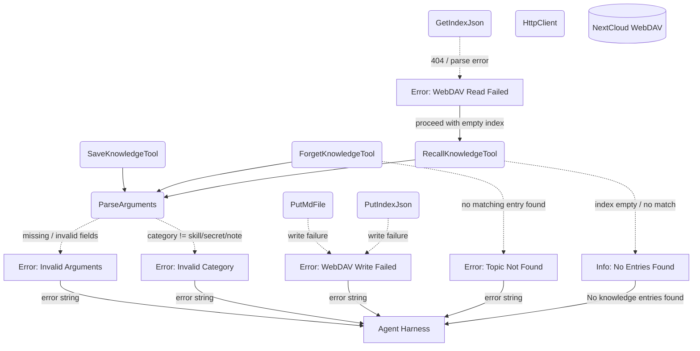

# Error Handling & Fallbacks

## 1. Purpose

Error paths and fallbacks shared by all three knowledge tools — invalid
arguments, write/read failures, and empty-result handling. See the happy
flows: [save](../save.md), [forget](../forget.md), and [recall](../recall.md).

## 2. Diagram

